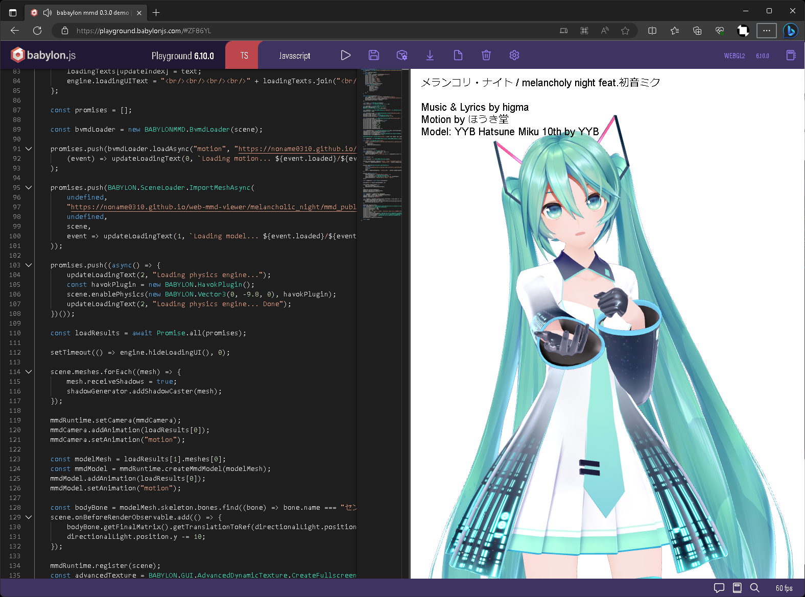

# babylon-mmd

mmd loader and runtime for Babylon.js

## Screenshots


Model: [YYB Hatsune Miku_10th](https://www.deviantart.com/sanmuyyb/art/YYB-Hatsune-Miku-10th-DL-702119716)



### https://playground.babylonjs.com/#ZF86YL

Model: [YYB Hatsune Miku_10th](https://www.deviantart.com/sanmuyyb/art/YYB-Hatsune-Miku-10th-DL-702119716)

Motion / Camera: https://www.nicovideo.jp/watch/sm41164308

Music: https://youtu.be/y__uZETTuL8

## How to use

First, install the package.
```bash
npm add @babylonjs/core @babylonjs/havok babylon-mmd
```

Here is the code to build a scene with a simple MMD model and play a VMD animation.
```typescript
async function build(canvas: HTMLCanvasElement, engine: Engine): Scene {
    // If you don't want full SDEF support on shadow / depth rendering, you can comment out this line as well. While using SDEF can provide similar results to MMD, it comes with a higher cost.
    SdefInjector.OverrideEngineCreateEffect(engine);

    const pmxLoader = new PmxLoader();

    // If you don't want SDEF support, you can uncomment this line. This can save some performance.
    // pmxLoader.useSdef = false;
    
    // you can create your own material builder and override the default one for custom shading
    const materialBuilder = pmxLoader.materialBuilder as MmdStandardMaterialBuilder;

    // If you don't want sphere texture support, you can uncomment this line. This can save some performance.
    // materialBuilder.loadSphereTexture = (): void => { /* do nothing */ };

    // If you don't want toon texture support, you can uncomment this line. This can save some performance.
    // materialBuilder.loadToonTexture = (): void => { /* do nothing */ };

    // If you don't want outline rendering, you can uncomment this line. This rendering operation can be quite expensive.
    // materialBuilder.loadOutlineRenderingProperties = (): void => { /* do nothing */ };
    
    SceneLoader.RegisterPlugin(pmxLoader);

    const scene = new Scene(engine);
    scene.clearColor = new Color4(1, 1, 1, 1.0);

    const camera = new MmdCamera("mmdCamera", new Vector3(0, 10, 0), scene);
    camera.maxZ = 5000;

    const hemisphericLight = new HemisphericLight("light1", new Vector3(0, 1, 0), scene);
    hemisphericLight.intensity = 0.4;
    hemisphericLight.specular = new Color3(0, 0, 0);
    hemisphericLight.groundColor = new Color3(1, 1, 1);

    const directionalLight = new DirectionalLight("DirectionalLight", new Vector3(0.5, -1, 1), scene);
    directionalLight.intensity = 0.8;
    directionalLight.autoCalcShadowZBounds = false;
    directionalLight.autoUpdateExtends = false;
    directionalLight.shadowMaxZ = 20;
    directionalLight.shadowMinZ = -15;
    directionalLight.orthoTop = 19;
    directionalLight.orthoBottom = -1;
    directionalLight.orthoLeft = -9;
    directionalLight.orthoRight = 9;
    directionalLight.shadowOrthoScale = 0;

    const shadowGenerator = new ShadowGenerator(1024, directionalLight, true, camera);
    shadowGenerator.usePercentageCloserFiltering = true;
    shadowGenerator.forceBackFacesOnly = true;
    shadowGenerator.filteringQuality = ShadowGenerator.QUALITY_MEDIUM;
    shadowGenerator.frustumEdgeFalloff = 0.1;
    
    const ground = MeshBuilder.CreateGround("ground1", { width: 60, height: 60, subdivisions: 2, updatable: false }, scene);
    ground.receiveShadows = true;
    shadowGenerator.addShadowCaster(ground);

    // use havok physics engine for rigid body/joint simulation
    const havokInstance = await HavokPhysics();
    const havokPlugin = new HavokPlugin(true, havokInstance);
    scene.enablePhysics(new Vector3(0, -9.8, 0), havokPlugin);

    const model = await SceneLoader.ImportMeshAsync(undefined, "your_model_path.pmx", undefined, scene)
        .then((result) => result.meshes[0]); // importMeshAsync meshes always have length 1
    model.receiveShadows = true;
    shadowGenerator.addShadowCaster(model);
    
    const vmdLoader = new VmdLoader(scene);

    const cameraMotion = await vmdLoader.loadAsync("camera_motion_1", "your_camera_motion_path.vmd");
    const modelMotion = await vmdLoader.loadAsync("model_motion_1", "your_model_motion_path.vmd");

    // register the model to the MMD runtime for solving morph, append transform, IK, animation, physics
    const mmdRuntime = new MmdRuntime(new MmdPhysics(scene));
    mmdRuntime.setCamera(camera);
    camera.addAnimation(cameraMotion);
    camera.setAnimation("camera_motion_1");

    const mmdModel = mmdRuntime.createMmdModel(model);
    mmdModel.addAnimation(modelMotion);
    mmdModel.setAnimation("model_motion_1");

    // register update function to the scene
    mmdRuntime.register(scene);
    
    // or you can update manually
    // scene.onBeforeAnimationsObservable.add(() => mmdRuntime.beforePhysics());
    // scene.onBeforeRenderObservable.add(() => mmdRuntime.afterPhysics());

    // currently theres no audio sync support
    const sound = new Sound("sound",
        "your_audio_path.mp3",
        scene, () => {
            sound.play();
            mmdRuntime.playAnimation();
        }, {
            loop: false,
            autoplay: false
        }
    );

    // for anti-aliasing
    const defaultPipeline = new DefaultRenderingPipeline("default", true, scene, [camera]);
    defaultPipeline.samples = 4;
    defaultPipeline.fxaaEnabled = true;

    return scene;
}
```

## Use optimized custom format

The optimized custom formats, BPMX (BabylonPMX) and BVMD (BabylonVMD), handle most of the validation and parsing process required for loading at the conversion stage.

As a result, you can provide users with an **incredibly fast loading experience**.

Furthermore, it is also useful when you want to protect the original motion files since they cannot be loaded in MMD.

To perform file conversion, please visit below link and load the desired motions. Then, simply click on "convert". By default, it is possible to merge one camera motion and one model motion together.

### [converter](https://noname0310.github.io/babylon-mmd/converter)

then you can load the converted files like below.

```typescript
// bpmx not implemented yet...

const bvmdLoader = new BvmdLoader(scene);
const motion = async bvmdLoader.loadAsync("motion_1", "your_motion_path.bvmd");
```

## Implementation status

**Parser**

- [x] PMX Parser
- [x] VMD Parser
- [ ] Optimized Custom PMX like format
- [x] Optimized Custom VMD like format

**PMX Loader**

> Mesh
- [x] Vertex, Normal, UV, Face load
- [x] Bone weight load / Bone Structure build
- [x] Morph target load

> Material / Shading
- [x] Basic material parameters load
- [x] Toon texture support
- [x] Sphere texture support
- [x] Edge(outline) rendering support
- [x] Spherical Deformation support
- [x] WebGL 1.0 support
- [x] WebGL 2.0 support
- [x] WebGPU support

> MMD runtime parameters
- [x] Transform order
- [x] Additional transform parameters load
- [x] IK parameters load
- [x] Rigid body / Joint parameters load

**VMD Loader**

- [x] Basic animation load
- [x] Support custom retargeting

**Animation Runtime**

- [x] Basic animation load
- [x] MMD morph system support
- [x] Solve Append transform
- [x] Solve IK
- [ ] Play audio / sync with animation
- [ ] Basic animation player UI

**Physics Runtime**

- [ ] Solve Rigid body / Joint - It's not perfect yet
- [ ] Support custom physics engine for parallel computing

## Not planned features

- PMX 2.1 support (because 2.1 spec not implemented in MMD)
- PMD format support
- Self shadow, Ground shadow spec support
- Additional UV support

## References

[PMX (Polygon Model eXtended) 2.0, 2.1 File Format Specifications](https://gist.github.com/felixjones/f8a06bd48f9da9a4539f)

[blender_mmd_tools](https://github.com/powroupi/blender_mmd_tools)

[Saba: OpenGL Viewer (OBJ PMD PMX)](https://github.com/benikabocha/saba)

[three.js MMDLoader](https://threejs.org/docs/#examples/en/loaders/MMDLoader)
