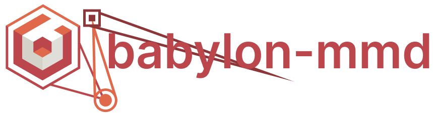

# babylon-mmd

<p align="center">  </p>

Babylon.js loader and runtime for MikuMikuDance (MMD) models and animations. It supports PMX/PMD model formats, VMD/VPD animation formats, and provides a runtime for physics, IK, morphs, and more.


### [Playground Demo](https://www.babylonjs-playground.com/#C46RTJ)

<details>
<summary>Credits</summary>

Music: [メランコリ・ナイト](https://youtu.be/y__uZETTuL8)

Model: [YYB Hatsune Miku_10th](https://www.deviantart.com/sanmuyyb/art/YYB-Hatsune-Miku-10th-DL-702119716)

Motion / Camera: https://www.nicovideo.jp/watch/sm41164308

</details>

https://github.com/user-attachments/assets/64207280-560a-49b5-ba50-bba7959dc79a

<details>
<summary>Credits</summary>

Music: [ピチカートドロップス](https://youtu.be/eYKAwm-sZ-o)

Model: [YYB Piano dress Miku](https://www.deviantart.com/mamiya-mmd/art/YYB-Piano-dress-Miku-and-Rin-Models-Download-831030256)  

Stage: [ガラス片ドーム](http://nebusokummd.blog.shinobi.jp/)  

Motion: https://www.nicovideo.jp/watch/sm31508557  

Camera: https://www.nicovideo.jp/watch/sm36273873  

</details>

## [Documentation](https://noname0310.github.io/babylon-mmd/)

Please refer to the documentation for detailed instructions on how to use it.

## Usage

Here is how to load and animate an MMD model using babylon-mmd. For more details, please refer to the [Documentation](https://noname0310.github.io/babylon-mmd/).

```typescript
// side effects that register the loader
import "babylon-mmd/esm/Loader/pmxLoader";

// side effects that register the animation runtime
import "babylon-mmd/esm/Runtime/Animation/mmdRuntimeCameraAnimation";
import "babylon-mmd/esm/Runtime/Animation/mmdRuntimeModelAnimation";

async function build(canvas: HTMLCanvasElement, engine: Engine): Scene {
    // If you don't want full SDEF support on shadow / depth rendering, you can comment out this line as well. While using SDEF can provide similar results to MMD, it comes with a higher cost.
    SdefInjector.OverrideEngineCreateEffect(engine);

    const scene = new Scene(engine);
    scene.ambientColor = new Color3(0.5, 0.5, 0.5);

    const camera = new MmdCamera("mmdCamera", new Vector3(0, 10, 0), scene);

    const hemisphericLight = new HemisphericLight("light1", new Vector3(0, 1, 0), scene);
    hemisphericLight.intensity = 0.3;
    hemisphericLight.specular = new Color3(0, 0, 0);
    hemisphericLight.groundColor = new Color3(1, 1, 1);

    const directionalLight = new DirectionalLight("DirectionalLight", new Vector3(0.5, -1, 1), scene);
    directionalLight.intensity = 0.7;
    
    CreateGround("ground1", { width: 60, height: 60, subdivisions: 2, updatable: false }, scene);
    
    const mmdWasmInstance = await GetMmdWasmInstance(new MmdWasmInstanceTypeMPR());
    const physicsRuntime = new MultiPhysicsRuntime(mmdWasmInstance);
    physicsRuntime.setGravity(new Vector3(0, -98, 0));
    
    // MMD runtime for solving morph, append transform, IK, animation, physics
    const mmdRuntime = new MmdRuntime(scene, new MmdBulletPhysics(physicsRuntime));
    mmdRuntime.register(scene);
    
    // For synced audio playback
    const audioPlayer = new StreamAudioPlayer();
    audioPlayer.source = "your_audio_path.mp3";
    mmdRuntime.setAudioPlayer(audioPlayer);
    
    // You can also run the animation before it loads. This will allow the audio to run first.
    mmdRuntime.playAnimation();

    // create a youtube-like player control
    new MmdPlayerControl(scene, mmdRuntime, audioPlayer);
    
    const vmdLoader = new VmdLoader(scene);

    const cameraAnimation = await vmdLoader.loadAsync("camera_motion", "your_camera_motion_path.vmd");
    const cameraRuntimeAnimationHandle = camera.createRuntimeAnimation(cameraAnimation);
    camera.setRuntimeAnimation(cameraRuntimeAnimationHandle);
    mmdRuntime.addAnimatable(camera);

    const assetContainer = await loadAssetContainerAsync("path/to/your_file.pmx", scene);
    assetContainer.addAllToScene();
    const mmdMesh = assetContainer.meshes[0] as MmdMesh;

    const mmdModel = mmdRuntime.createMmdModel(mmdMesh, {
        materialProxyConstructor: MmdStandardMaterialProxy
    });
    const modelMotion = await vmdLoader.loadAsync("model_motion", "your_model_motion_path.vmd");
    const modelRuntimeAnimationHandle = mmdModel.createRuntimeAnimation(modelMotion);
    mmdModel.setRuntimeAnimation(modelRuntimeAnimationHandle);

    return scene;
}
```

## Implementation status

**Parser**

- [x] PMX Parser
- [x] PMD Parser
- [x] VMD Parser
- [x] VPD Parser
- [x] Optimized Custom PMX like format
- [x] Optimized Custom VMD like format

**PMX / PMD Loader**

> Mesh
- [x] Geometry load
- [x] Build Bone / MorphTarget

> Material / Shading
- [x] Basic material parameters load
- [x] Custom MMD toon fragment shader
- [x] Spherical Deformation support
- [x] WebGL 1.0 / 2.0 support
- [x] WebGPU support

**VMD / VPD Loader**

- [x] Basic animation load / custom retargeting
- [x] Load animation using the Babylon.js `Animation` container
- [x] Babylon.js `Animation` Humanoid to MMD bone retargeting

**Animation Runtime**

- [x] Basic animation load
- [x] MMD morph system support
- [x] Solve Append transform
- [x] Solve IK
- [x] Play audio / sync with animation
- [x] Basic animation player UI
- [x] Animation blending in custom animation runtime
- [x] Force Humanoid Model Support

**Physics Runtime**

- [x] Solve Rigid body / Joint
- [x] WASM based runtime for threaded bullet physics and MMD IK

## Not planned features

- PMX 2.1 support (because 2.1 spec not implemented in MMD)
- Self shadow, Ground shadow spec support

## [Support](https://github.com/sponsors/noname0310) this project

Advanced technical support is available for those supporting the project

Contact me via email or discord

email: hjnam2014@gmail.com

discord: noname0310

## References

[PMX (Polygon Model eXtended) 2.0, 2.1 File Format Specifications](https://gist.github.com/felixjones/f8a06bd48f9da9a4539f)

[blender_mmd_tools](https://github.com/powroupi/blender_mmd_tools)

[Saba: OpenGL Viewer (OBJ PMD PMX)](https://github.com/benikabocha/saba)

[three.js MMDLoader](https://threejs.org/docs/#examples/en/loaders/MMDLoader)
