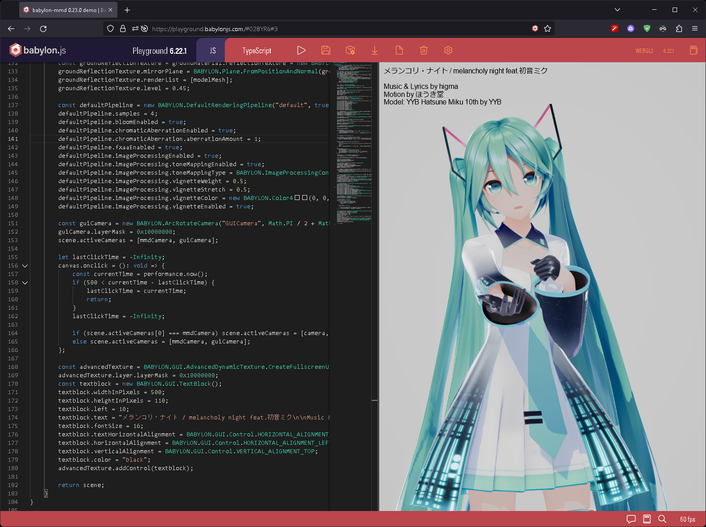

# babylon-mmd

mmd loader and runtime for Babylon.js

## Screenshots

https://github.com/noname0310/babylon-mmd/assets/48761044/288bfeda-c672-4c0b-8eb4-5c96ca580b71

Music: [ピチカートドロップス](https://youtu.be/eYKAwm-sZ-o)

Model: [YYB Piano dress Miku](https://www.deviantart.com/mamiya-mmd/art/YYB-Piano-dress-Miku-and-Rin-Models-Download-831030256)

Stage: [ガラス片ドーム](http://nebusokummd.blog.shinobi.jp/)

Motion: https://www.nicovideo.jp/watch/sm31508557

Camera: https://www.nicovideo.jp/watch/sm36273873



### https://playground.babylonjs.com/#028YR6#6 - JavaScript Runtime (stable)

### https://playground.babylonjs.com/#MY96ZK - Web-Assembly Runtime (experimental)

Music: [メランコリ・ナイト](https://youtu.be/y__uZETTuL8)

Model: [YYB Hatsune Miku_10th](https://www.deviantart.com/sanmuyyb/art/YYB-Hatsune-Miku-10th-DL-702119716)

Motion / Camera: https://www.nicovideo.jp/watch/sm41164308

## How to use

First, install the package.
```bash
npm add @babylonjs/core @babylonjs/havok babylon-mmd
```

Here is the code to build a scene with a simple MMD model and play a VMD animation.
```typescript
// side effects that register the loader
import "babylon-mmd/esm/Loader/pmxLoader";

// side effects that register the animation runtime
import "babylon-mmd/esm/Runtime/Animation/mmdRuntimeCameraAnimation";
import "babylon-mmd/esm/Runtime/Animation/mmdRuntimeModelAnimation";

async function build(canvas: HTMLCanvasElement, engine: Engine): Scene {
    // If you don't want full SDEF support on shadow / depth rendering, you can comment out this line as well. While using SDEF can provide similar results to MMD, it comes with a higher cost.
    SdefInjector.OverrideEngineCreateEffect(engine);

    const scene = new Scene(engine);
    scene.ambientColor = new Color3(1, 1, 1);

    const camera = new MmdCamera("mmdCamera", new Vector3(0, 10, 0), scene);

    const hemisphericLight = new HemisphericLight("light1", new Vector3(0, 1, 0), scene);
    hemisphericLight.intensity = 0.3;
    hemisphericLight.specular = new Color3(0, 0, 0);
    hemisphericLight.groundColor = new Color3(1, 1, 1);

    const directionalLight = new DirectionalLight("DirectionalLight", new Vector3(0.5, -1, 1), scene);
    directionalLight.intensity = 0.7;
    
    CreateGround("ground1", { width: 60, height: 60, subdivisions: 2, updatable: false }, scene);
    
    // Use havok physics engine for rigid body/joint simulation
    const havokInstance = await HavokPhysics();
    const havokPlugin = new HavokPlugin(true, havokInstance);
    scene.enablePhysics(new Vector3(0, -9.8 * 10, 0), havokPlugin);
    
    // MMD runtime for solving morph, append transform, IK, animation, physics
    const mmdRuntime = new MmdRuntime(scene, new MmdPhysics(scene));
    mmdRuntime.register(scene);
    
    // For synced audio playback
    const audioPlayer = new StreamAudioPlayer();
    audioPlayer.source = "your_audio_path.mp3";
    mmdRuntime.setAudioPlayer(audioPlayer);
    
    // You can also run the animation before it loads. This will allow the audio to run first.
    mmdRuntime.playAnimation();

    // create a youtube-like player control
    new MmdPlayerControl(scene, mmdRuntime, audioPlayer);
    
    const vmdLoader = new VmdLoader(scene);

    mmdRuntime.setCamera(camera);
    const cameraMotion = await vmdLoader.loadAsync("camera_motion_1", "your_camera_motion_path.vmd");
    camera.addAnimation(cameraMotion);
    camera.setAnimation("camera_motion_1");

    const model = await SceneLoader.ImportMeshAsync(undefined, "your/root/path/", "your_file_name.pmx", scene).then((result) => result.meshes[0]);
    const mmdModel = mmdRuntime.createMmdModel(model);
    const modelMotion = await vmdLoader.loadAsync("model_motion_1", "your_model_motion_path.vmd");
    mmdModel.addAnimation(modelMotion);
    mmdModel.setAnimation("model_motion_1");

    return scene;
}
```

If your model uses textures such as TGA, don't forget to also import the side effects for TGA textures.

```typescript
// side effects for TGA textures
import "@babylonjs/core/Materials/Textures/Loaders/tgaTextureLoader";
```

## Use optimized custom format

The optimized custom formats, BPMX (BabylonPMX) and BVMD (BabylonVMD), handle most of the validation and parsing process required for loading at the conversion stage.

As a result, you can provide users with an **incredibly fast loading experience**.

Furthermore, it is also useful when you want to protect the original model/motion files since they cannot be loaded in MMD.

### PMX to BPMX

To perform pmx conversion, please visit below link and load the desired models directory. Then select the model you want to convert and click on "convert".

### [pmx converter](https://noname0310.github.io/babylon-mmd/pmx_converter)

then you can load the converted files like below.

```typescript
// side effects that register the loader
import "babylon-mmd/esm/Loader/Optimized/bpmxLoader";

const model = await SceneLoader.ImportMeshAsync(undefined, "your/root/path/", "your_file_name.bpmx", scene).then((result) => result.meshes[0]);
```

### VMD to BVMD

To perform vmd conversion, please visit below link and load the desired motions. Then, simply click on "convert". By default, it is possible to merge one camera motion and one model motion together.

### [vmd converter](https://noname0310.github.io/babylon-mmd/vmd_converter)

then you can load the converted files like below.

```typescript
const bvmdLoader = new BvmdLoader(scene);
const motion = await bvmdLoader.loadAsync("motion_1", "your_motion_path.bvmd");
```

## Documentation

Please refer to the documentation for more detailed instructions on how to use it.

- [Documentation](https://noname0310.github.io/babylon-mmd/)

## Implementation status

**Parser**

- [x] PMX Parser
- [x] PMD Parser
- [x] VMD Parser
- [x] VPD Parser
- [x] Optimized Custom PMX like format
- [x] Optimized Custom VMD like format

**PMX / PMD Loader**

> Mesh
- [x] Geometry load
- [x] Build Bone / MorphTarget

> Material / Shading
- [x] Basic material parameters load
- [x] Custom MMD toon fragment shader
- [x] Spherical Deformation support
- [x] WebGL 1.0 / 2.0 support
- [x] WebGPU support

**VMD / VPD Loader**

- [x] Basic animation load / custom retargeting
- [x] Load animation using the Babylon.js `Animation` container
- [x] Babylon.js `Animation` Humanoid to MMD bone retargeting

**Animation Runtime**

- [x] Basic animation load
- [x] MMD morph system support
- [x] Solve Append transform
- [x] Solve IK
- [x] Play audio / sync with animation
- [x] Basic animation player UI
- [x] Animation blending in custom animation runtime
- [x] Force Humanoid Model Support

**Physics Runtime**

- [x] Solve Rigid body / Joint
- [ ] WASM based runtime for threaded bullet physics and MMD IK

## Not planned features

- PMX 2.1 support (because 2.1 spec not implemented in MMD)
- Self shadow, Ground shadow spec support

## [Support](https://github.com/sponsors/noname0310) this project

Advanced technical support is available for those supporting the project

Contact me via email or discord

email: hjnam2014@gmail.com

discord: noname0310

## References

[PMX (Polygon Model eXtended) 2.0, 2.1 File Format Specifications](https://gist.github.com/felixjones/f8a06bd48f9da9a4539f)

[blender_mmd_tools](https://github.com/powroupi/blender_mmd_tools)

[Saba: OpenGL Viewer (OBJ PMD PMX)](https://github.com/benikabocha/saba)

[three.js MMDLoader](https://threejs.org/docs/#examples/en/loaders/MMDLoader)
