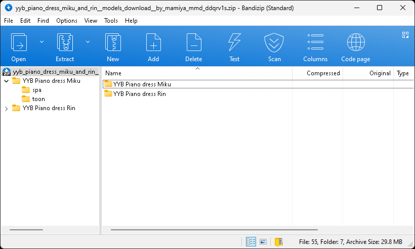
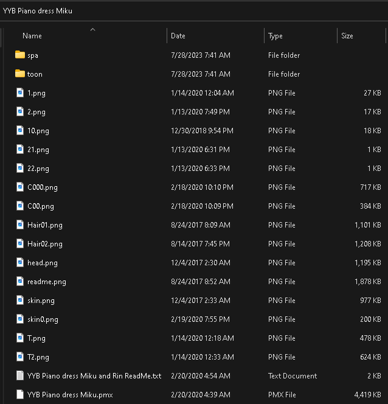
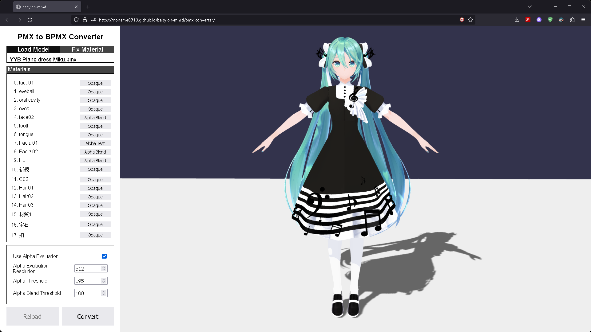
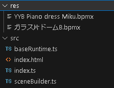

# Convert PMX model into BPMX

Babylon PMX(BPMX) is the optimized PMX format for babylon-mmd.

It reduces model load time By merge all dependencies(texture) into a single file.

## Download MMD Model: "YYB Piano dress Miku"

If you have a pmx model you want, you can use it.

In this tutorial, we will use the "YYB Piano dress Miku" model.

You can download it from [here](https://www.deviantart.com/mamiya-mmd/art/YYB-Piano-dress-Miku-and-Rin-Models-Download-831030256).

Unzip the downloaded zip file.

## Convert PMX model into BPMX

You can use [PMX to BPMX Converter](https://noname0310.github.io/babylon-mmd/pmx_converter/) to convert PMX model into BPMX.

The pmx model typically places the texture asset as a child in the root directory.

Therefore, you need to put the root directory of pmx in the converter.

Then select pmx from the loaded file list and load it.

You can modify the material transparent mode in the Fix Material tab.

When you have finished modifying the material, you can press Convert to download the converted BPMX file.

Move the downloaded BPMX file to the "res" folder.

## Download MMD Stage: "ガラス片ドームB"

We use stage too. You can download it from [here](https://onedrive.live.com/?authkey=%21ACYieu0bTYFjEiE&id=BB455C87024D8563%21946&cid=BB455C87024D8563).

Convert the stage in the same way as above.

Your file structure should look like this.
