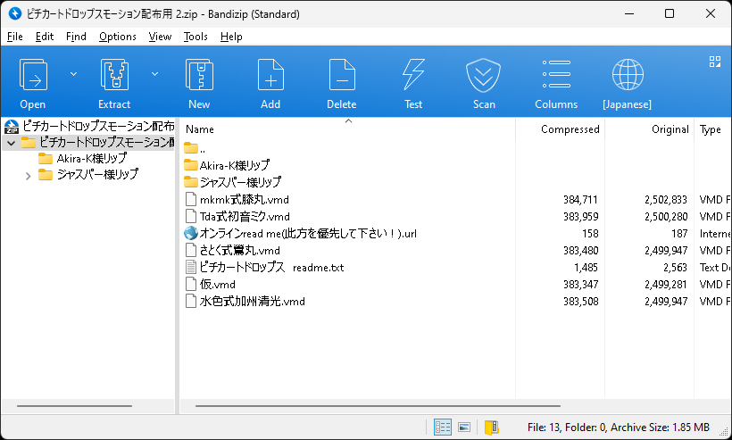
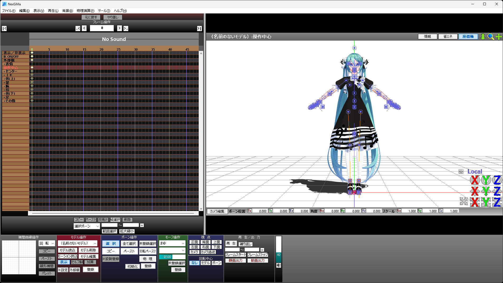
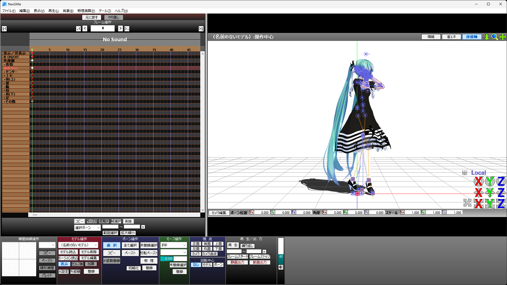
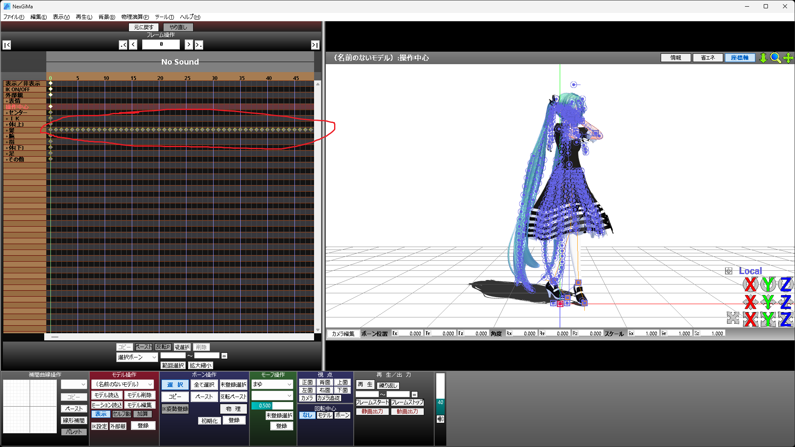
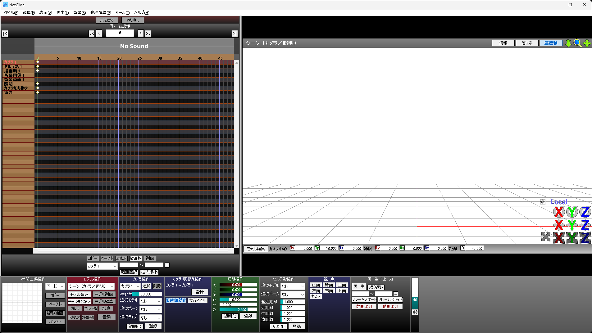

# Bake Physics Animation (External)

Use [NexGiMa](https://sites.google.com/view/nexgima/Home) to bake physics animation.

## Download Animation: "ピチカートドロップス"

If you already have a desired motion, feel free to use it. In this tutorial, we will use "ピチカートドロップス" by じゅんこだ and Akira-K

You can download the motion from **[here](https://bowlroll.net/file/133877)**.

Compressed files distributed by the Japanese often have encoding problems. Compression programs such as [Bandizip](https://en.bandisoft.com/bandizip/) can solve this problem by changing the codepage.

And We'll use 10 million's camera motion.

You can download the camera motion from **[here](https://www.nicovideo.jp/watch/sm36273873)**.

*Check the video description for the download link.*

unzip camera motion file as same as the motion file.

## Use NexGiMa to Bake Physics Animation

Download NexGiMa from **[here](https://sites.google.com/view/nexgima/Home)** and open it.

:::tip
NexGiMa is an MMD compatible program that supports baking physics animation.
:::

drag and drop the model file*(YYB Piano dress Miku/YYB Piano dress Miku.pmx)* into NexGiMa.

drag and drop the motion file*(ピチカートドロップスモーション配布用 2/Tda式初音ミク.vmd)* into NexGiMa.

click the "キー焼きこみ..." button to open the bake options window.

check the "物理焼き込み" option and click the "OK" button.

After baking, there is a physics animation. You can select all of these and export the animation.

Select the display frame for export the keyframes. then click the "範囲選択" for select all keyframes in the display frame.

Click the "モーションを保存する..." button to export the keyframes.

Save is as "pizzicato_drops_yyb_piano_miku_phys".

:::tip
Baked physics animations are only valid for the model you baked. so it is recommended to save the animation with the model name.
:::

:::danger
NexGiMa has a bug that does not properly convert bone name in certain Chinese characters. Therefore, for some models, the bone name needs to be modified.

The model we use as an example also has this problem, and we will try to use the animation retargeting function to solve it.
:::
