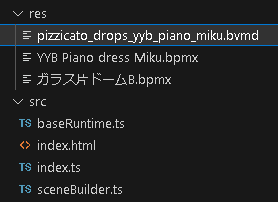

# Convert VMD animation into BVMD

Babylon VMD(BVMD) is the optimized VMD format for babylon-mmd.

By storing motion in a more efficient structure, BVMD reduces motion's file size by more than half and also reduces memory usage.

## Change Camera Animation Start Offset

The starting offset of the camera motion data we use does not match the model motion, so we need to match it.

For editing VMD, we use MMD.

You can download MMD from **[here](https://learnmmd.com/downloads/#latestMMD)**.

Drag and drop the VMD file*(ピチカートドロップス cam/ピチカートドロップス cam.vmd)* into MMD.

find the frame 343 and select all keyframes after it. you can use range select.

then *ctrl+c* to copy the keyframes. and *del* to delete the selected keyframes. then *ctrl+v* to paste the keyframes to the frame 291.

then save the VMD file by *file->save motion data*.

## Convert VMD animation into BVMD

You can use [VMD to BVMD Converter](https://noname0310.github.io/babylon-mmd/vmd_converter/) to convert VMD animation into BVMD.

:::info
One BVMD file can store one model animation and one camera animation. Therefore, in the case of a dance with one person in general, it is possible to combine all the animation data needed for playback into one file.
:::

drag and drop the VMD file in the list below.

- ピチカートドロップスモーション配布用 2/Tda式初音ミク.vmd
- ピチカートドロップスモーション配布用 2/Akira-K様リップ/ピチカートドロップス_lips.vmd
- pizzicato_drops_yyb_piano_miku_phys.vmd
- ピチカートドロップス cam/ピチカートドロップス cam.vmd

then click the "Convert" button.

Save the converted motion as *pizzicato_drops_yyb_piano_miku.bvmd* in the res folder.

