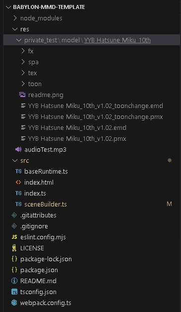
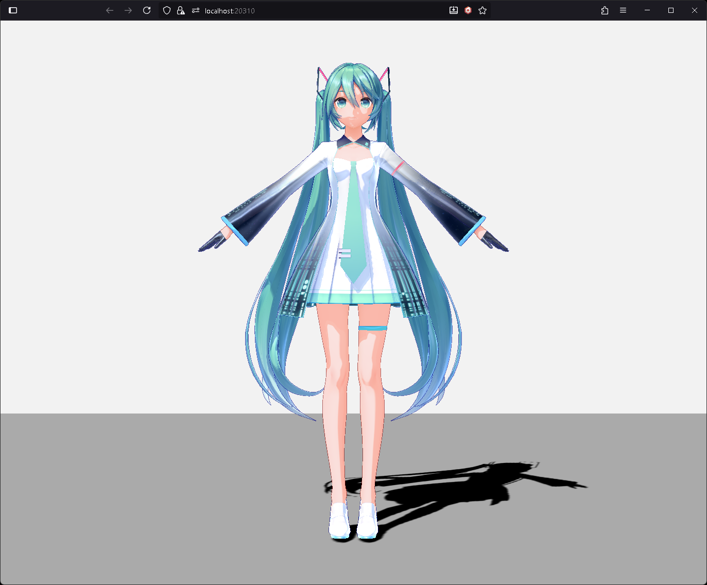

# Load MMD Model

Now we'll **load an MMD model** into the Scene and **add shadows**.

## Download PMX Model

First, we need a **PMX model** to load.

This example uses the [**YYB Hatsune Miku 10th Anniversary**](https://www.deviantart.com/sanmuyyb/art/YYB-Hatsune-Miku-10th-DL-702119716) model.

**Download the model**, extract it, and place it in the **`res/private_test/model/`** folder.

 \
*Model folder structure example*

## Import Required Side-Effects

First, import the **side-effects** needed to load the model.

```typescript title="src/sceneBuilder.ts"
//...
// highlight-start
import "babylon-mmd/esm/Loader/pmxLoader";
import "babylon-mmd/esm/Loader/mmdOutlineRenderer";
// highlight-end
//...
```

**babylon-mmd** extends **Babylon.js's SceneLoader** to enable loading **PMX/PMD models**.

To load **PMD models**, import **`babylon-mmd/esm/Loader/pmdLoader`** and use the same method as loading PMX models described below.

**`mmdOutlineRenderer`** provides functionality to **draw outlines** for MMD models. If **outline rendering is not needed**, you don't need to import it.

## Load PMX Model

Use the **`LoadAssetContainerAsync`** function to load the model. You can specify the **`mmdmodel`** option in **`pluginOptions`** to pass necessary settings to the MMD model loader.

```typescript title="src/sceneBuilder.ts"
//...
// highlight-next-line
import { LoadAssetContainerAsync } from "@babylonjs/core/Loading/sceneLoader";
//...
// highlight-next-line
import { MmdStandardMaterialBuilder } from "babylon-mmd/esm/Loader/mmdStandardMaterialBuilder";
//...
// highlight-next-line
import type { MmdMesh } from "babylon-mmd/esm/Runtime/mmdMesh";
//...

export class SceneBuilder implements ISceneBuilder {
    public async build(_canvas: HTMLCanvasElement, engine: AbstractEngine): Promise<Scene> {
        // highlight-next-line
        const materialBuilder = new MmdStandardMaterialBuilder();
        const scene = new Scene(engine);
        // ...
        // highlight-start
        const modelMesh = await LoadAssetContainerAsync(
            "res/private_test/model/YYB Hatsune Miku_10th/YYB Hatsune Miku_10th_v1.02.pmx",
            scene,
            {
                pluginOptions: {
                    mmdmodel: {
                        loggingEnabled: true,
                        materialBuilder: materialBuilder
                    }
                }
            }).then(result => {
                result.addAllToScene();
                return result.rootNodes[0] as MmdMesh;
            });
        // highlight-end

        return scene;
    }
}
```

The settings passed to the **`pluginOptions.mmdmodel`** option when loading the model are as follows:
- **`loggingEnabled`**: Whether to output logs during the loading process. **Useful for debugging**.
- **`materialBuilder`**: Specifies the implementation for creating MMD model materials. **`MmdStandardMaterialBuilder`** is the default implementation for creating basic MMD materials. If you want to use **custom materials**, you can implement the **`IMmdMaterialBuilder`** interface and pass it.

When the model is loaded, an **`AssetContainer`** is returned. Call the **`addAllToScene`** method to add the model to the scene.
The model's **root node** can be accessed as the **first element** of the **`rootNodes`** array. For **MMD models**, the first root node always satisfies **`MmdMesh`**.

## Add Shadows to Model

To **add shadows** to the model, add the model to the **`ShadowGenerator`** we created earlier.

```typescript title="src/sceneBuilder.ts"
//...
export class SceneBuilder implements ISceneBuilder {
    public async build(_canvas: HTMLCanvasElement, engine: AbstractEngine): Promise<Scene> {
        //...
        // highlight-start
        for (const mesh of modelMesh.metadata.meshes) mesh.receiveShadows = true;
        shadowGenerator.addShadowCaster(modelMesh);
        // highlight-end
        return scene;
    }
}
//...
```

**MMD models** consist of **multiple meshes** divided by material. Therefore, we iterate through the **`modelMesh.metadata.meshes`** array and configure each mesh to **receive shadows**.

## Result

Now when you check the browser, you can see that the **model has been loaded**.



<details>
<summary>Full code</summary>
```typescript title="src/sceneBuilder.ts"
import "@babylonjs/core/Lights/Shadows/shadowGeneratorSceneComponent";
// highlight-start
import "babylon-mmd/esm/Loader/pmxLoader";
import "babylon-mmd/esm/Loader/mmdOutlineRenderer";
// highlight-end

import type { AbstractEngine } from "@babylonjs/core/Engines/abstractEngine";
import { DirectionalLight } from "@babylonjs/core/Lights/directionalLight";
import { ShadowGenerator } from "@babylonjs/core/Lights/Shadows/shadowGenerator";
// highlight-next-line
import { LoadAssetContainerAsync } from "@babylonjs/core/Loading/sceneLoader";
import { Color3, Color4 } from "@babylonjs/core/Maths/math.color";
import { Vector3 } from "@babylonjs/core/Maths/math.vector";
import { CreateGround } from "@babylonjs/core/Meshes/Builders/groundBuilder";
import { Scene } from "@babylonjs/core/scene";
// highlight-next-line
import { MmdStandardMaterialBuilder } from "babylon-mmd/esm/Loader/mmdStandardMaterialBuilder";
import { MmdCamera } from "babylon-mmd/esm/Runtime/mmdCamera";
// highlight-next-line
import type { MmdMesh } from "babylon-mmd/esm/Runtime/mmdMesh";

import type { ISceneBuilder } from "./baseRuntime";

export class SceneBuilder implements ISceneBuilder {
    public async build(_canvas: HTMLCanvasElement, engine: AbstractEngine): Promise<Scene> {
        // highlight-next-line
        const materialBuilder = new MmdStandardMaterialBuilder();
        const scene = new Scene(engine);
        scene.clearColor = new Color4(0.95, 0.95, 0.95, 1.0);
        scene.ambientColor = new Color3(0.5, 0.5, 0.5);

        const mmdCamera = new MmdCamera("MmdCamera", new Vector3(0, 10, 0), scene);

        const directionalLight = new DirectionalLight("DirectionalLight", new Vector3(0.5, -1, 1), scene);
        directionalLight.intensity = 1.0;
        directionalLight.autoCalcShadowZBounds = true;

        const shadowGenerator = new ShadowGenerator(1024, directionalLight, true);
        shadowGenerator.transparencyShadow = true;
        shadowGenerator.usePercentageCloserFiltering = true;
        shadowGenerator.forceBackFacesOnly = true;
        shadowGenerator.filteringQuality = ShadowGenerator.QUALITY_MEDIUM;
        shadowGenerator.frustumEdgeFalloff = 0.1;

        const ground = CreateGround("ground1", { width: 100, height: 100, subdivisions: 2, updatable: false }, scene);
        ground.receiveShadows = true;

        // highlight-start
        const modelMesh = await LoadAssetContainerAsync(
            "res/private_test/model/YYB Hatsune Miku_10th/YYB Hatsune Miku_10th_v1.02.pmx",
            scene,
            {
                pluginOptions: {
                    mmdmodel: {
                        loggingEnabled: true,
                        materialBuilder: materialBuilder
                    }
                }
            }).then(result => {
                result.addAllToScene();
                return result.rootNodes[0] as MmdMesh;
            });

        for (const mesh of modelMesh.metadata.meshes) mesh.receiveShadows = true;
        shadowGenerator.addShadowCaster(modelMesh);
        // highlight-end

        return scene;
    }
}
```
</details>
