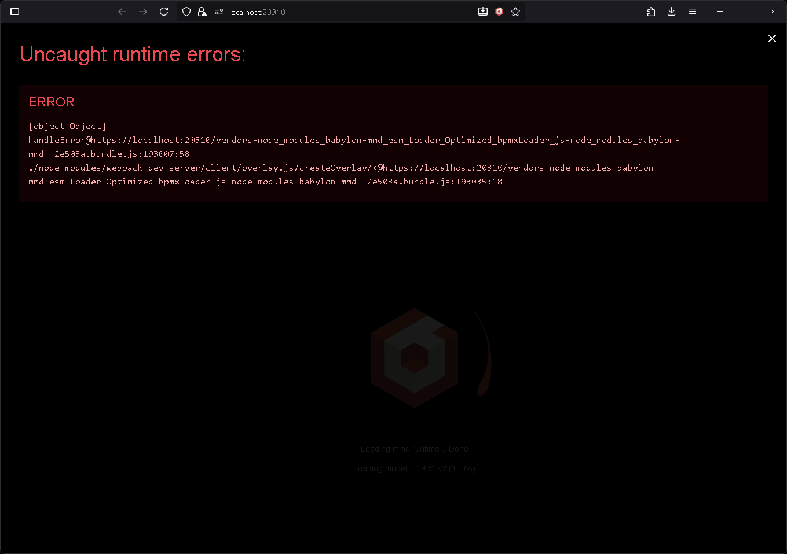

# Project Setup

First, we need to set up an **SPA project** to use **babylon-mmd**. This tutorial uses a [**webpack**](https://webpack.js.org/)-based project template.

Start by cloning the project with the following command:

```bash
git clone https://github.com/noname0310/babylon-mmd-template
```

This project includes configurations for using **TypeScript**, **Webpack**, **ESLint**, **Babylon.js**, and **babylon-mmd**.

The specific build and development environment configurations are as follows:

- **TypeScript** (tsconfig.json)
  - **"@/" alias** for referencing the src folder
  - **Strict mode** enabled with other strict type checking

- **Webpack** (webpack.config.ts)
  - **Dev server** configuration (https, localhost:20310)
  - **SharedArrayBuffer** enabled (cross-origin-isolated)
  - All resources in the **res folder** can be loaded via fetch (CopyWebpackPlugin)
  - **ESLint auto fix** on save
  - **Shader code chunk splitting**
  - **SourceMap** enabled (dev mode)

- **ESLint** (eslint.config.mjs)
  - Configuration aligned with **Babylon.js coding style guide**

The source structure of this project is as follows:

```
/ (root)
├── /res: Folder containing PMX models, VMD animations, MP3 audio, etc.
├── /src: Folder containing the project's source code
│   ├── /baseRuntime.ts: Babylon.js engine creation and rendering loop setup code
│   ├── /index.html: HTML template
│   ├── /index.ts: Entry point, creates scene using scene builder and starts rendering loop
│   └── /sceneBuilder.ts: Code that configures the Scene
```

We will only modify the **sceneBuilder.ts** file to configure the **MMD scene**.

First, install the project dependencies and start the development server:

```bash
npm install
npm start
```

When you open [https://localhost:20310](https://localhost:20310) in your browser, you'll see the following error:



The **sceneBuilder.ts** file contains a **babylon-mmd example using WebXR** by default.
However, an error occurs because there are **no MMD models and animations** to load.

We will **completely rewrite** the sceneBuilder.ts file to configure the MMD scene.

Start with an **empty `build` method** as follows:

```typescript title="src/sceneBuilder.ts"
import type { AbstractEngine } from "@babylonjs/core/Engines/abstractEngine";
import { Scene } from "@babylonjs/core/scene";

import type { ISceneBuilder } from "./baseRuntime";

export class SceneBuilder implements ISceneBuilder {
    public async build(_canvas: HTMLCanvasElement, engine: AbstractEngine): Promise<Scene> {
        const scene = new Scene(engine);
        return scene;
    }
}
```
