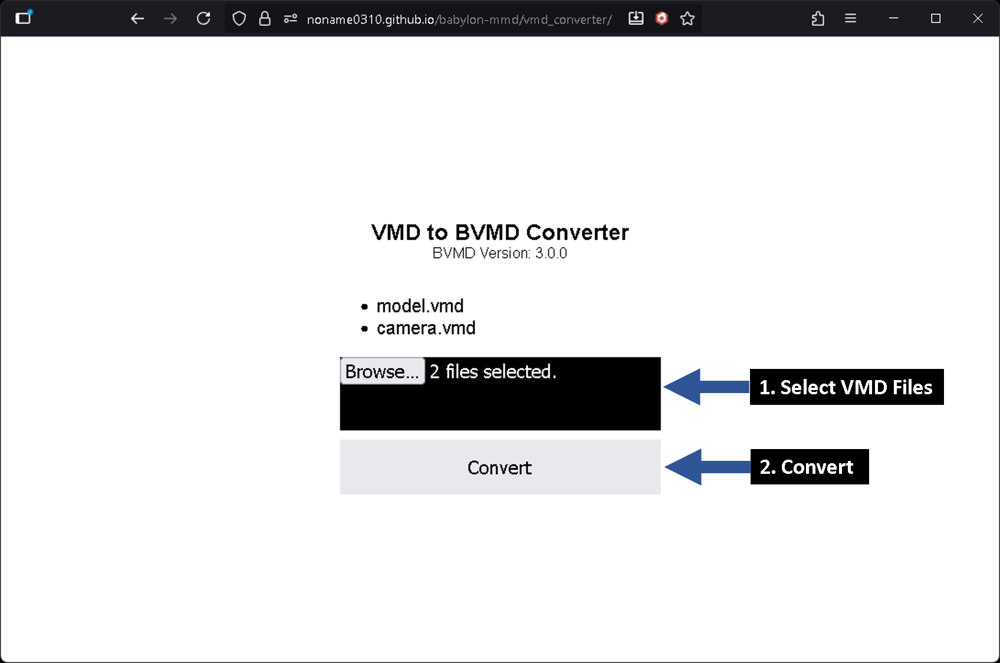

# Convert VMD to BVMD format

This section explains how to convert **VMD** files to **BVMD** files.

To convert **VMD** files to **BVMD** files, you can use one of the following two methods:

- You can use a web application for conversion.
- You can convert them programmatically.

**Both methods produce identical results.**

## Use Converter Application

**babylon-mmd** provides a web application to convert **VMD** files to **BVMD** files.

You can use the application at the link below.

[VMD to BVMD Converter](https://noname0310.github.io/babylon-mmd/vmd_converter/)


*Screenshot of the **VMD to BVMD Converter.*

1. **Drag and drop one or more VMD files.**
    - If you drop multiple **VMD** files, they will be merged, and keyframes from the files dropped first will take precedence.

2. **Perform the conversion.**

## Programmatic Conversion

**BVMD** conversion is performed using the **`BvmdConverter`** class.

The **`BvmdConverter`** takes an **`MmdAnimation`** object as input and converts it to **BVMD** format data.

```typescript
const vmdLoader = new VmdLoader();
const mmdAnimation: MmdAnimation = await vmdLoader.loadAsync("path/to/your/file.vmd");

const arrayBuffer = BvmdConverter.Convert(mmdAnimation);
```

This works exactly the same way as the web application version.
