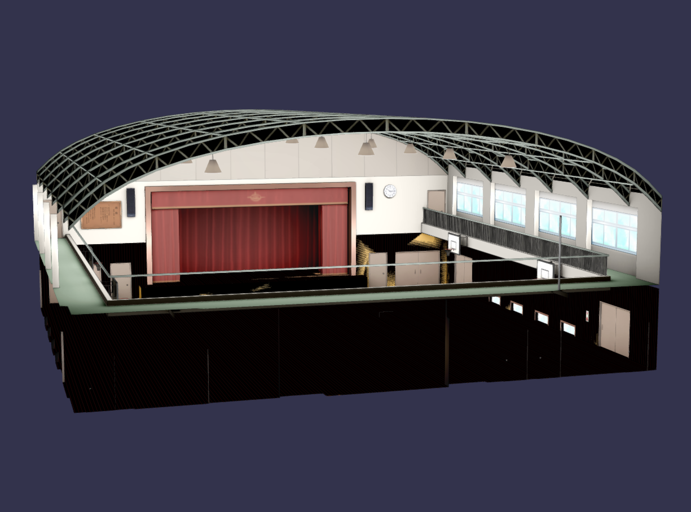

# Fix BMP Texture Loader

If you encounter issues when **loading models that use BMP textures**, you can refer to this document to resolve the problem.

## Problem Diagnosis


*Example of **incorrectly loaded texture** from the [MMD School Auditorium Stage](https://www.deviantart.com/maddoktor2/art/DL-MMD-School-Auditorium-Stage-665280215) stage model.*

When loading models that use **BMP textures**, there are cases where **BMP files with alpha channels are not displayed properly**.

## Cause

This issue occurs due to **differences in how browsers and MMD read BMP texture files**. (Babylon.js uses the browser's BMP texture loading implementation.)

The problem is that **browsers ignore the alpha channel and only read RGB channels**, even when the texture has an alpha channel. This causes **alpha channel loss**.

## Solution

babylon-mmd provides a **BMP texture loader that performs additional processing** to correctly load BMP textures.

To use this, you need to **register babylon-mmd's BMP texture loader** to the Babylon.js texture loader global state.

```typescript
import { RegisterDxBmpTextureLoader } from "babylon-mmd/esm/Loader/registerDxBmpTextureLoader";

RegisterDxBmpTextureLoader();
```

The **`RegisterDxBmpTextureLoader` function registers babylon-mmd's BMP texture loader** to Babylon.js's texture loader. This function **only affects the first call**.

:::info
This function is a **side-effect that runs when importing the index**. e.g. `import { MmdRuntime } from "babylon-mmd";`

Therefore, if you **import babylon-mmd's index even once**, the `DxBmpTextureLoader` will already be registered.
:::


*Example of **correctly loaded texture** from the MMD School Auditorium Stage stage model.*
