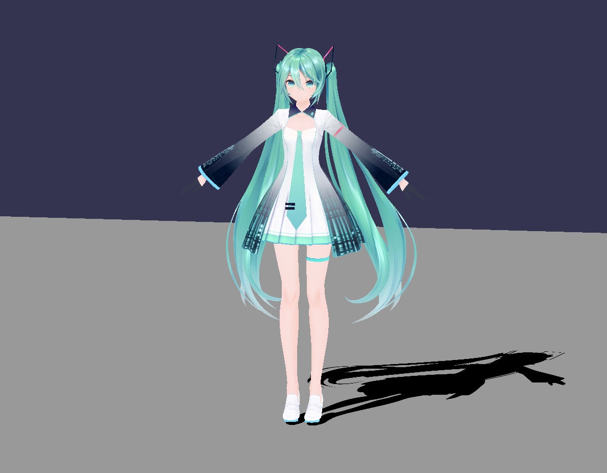
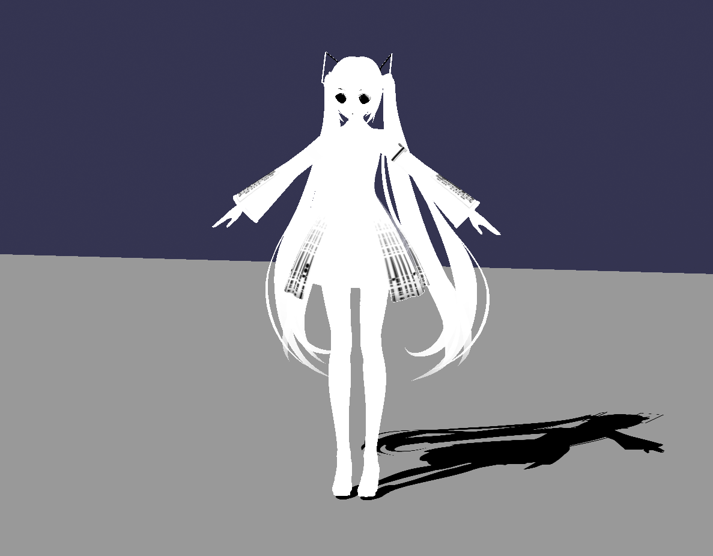

# MMD StandardMaterial

This section explains the **`MmdStandardMaterial`** provided by babylon-mmd to reproduce MMD's shading model.

**`MmdStandardMaterial`** implements MMD's shading model by modifying shaders using **`MaterialPlugin`** based on Babylon.js's **`StandardMaterial`**.

## MMD's Shading Model and `MmdStandardMaterial`

### Lighting

MMD always has **one Directional Light** that exists globally in the Scene, and there are no additional lights.

babylon-mmd's **`MmdStandardMaterial`** reproduces this shading model of MMD, so it works best in situations where there is **only one Directional Light** in the Scene. It is designed to work in other scenarios as well, but may not look visually appealing.

### Ground Shadow

MMD implements shadows on the ground specifically by **projecting Mesh onto the ground**. This is called a **ground shadow**.

babylon-mmd does not implement this. (It may be added later if there are requests.)
Instead, you can implement shadows using Babylon.js's **ShadowGenerator**.

### Shadow

MMD controls whether a mesh **casts or receives Shadow** through Material properties. babylon-mmd does not implement this, and the responsibility for shadow control lies with the user. (This may also be added later if there are requests.)

### Render Method

MMD uses a **Forward Rendering** approach. The **Draw order** of each Mesh is always fixed in the order of Materials, and all materials perform **Depth Write and Depth Test** and are drawn using **Alpha Blending**.

## MMD Material Properties

MMD materials have various properties, and the **`MmdStandardMaterial`** class provides properties corresponding to each property of MMD materials.

The properties of MMD materials and their corresponding properties in **`MmdStandardMaterial`** are as follows:

| MMD Material Property | `MmdStandardMaterial` Property | Description |
|-----------------|----------------------------|------|
| diffuse(rgba) | diffuseColor(rgb), alpha(a) | Diffuse reflection color and transparency |
| specular(rgb) | specularColor | Specular reflection color |
| ambient(rgb) | ambientColor | Ambient light color |
| reflect | specularPower | Reflection intensity |
|-----------------|----------------------------|------|
| is double sided | backFaceCulling | Whether to render both sides of the mesh |
| ground shadow | N/A | Not implemented |
| draw shadow | N/A | Not implemented |
| receive shadow | N/A | Not implemented |
| toon edge | renderOutline | Whether to render outlines |
| vertex color (PMX 2.1 spec) | N/A | Not implemented |
| point draw (PMX 2.1 spec) | N/A | Not implemented |
| line draw (PMX 2.1 spec) | N/A | Not implemented |
|-----------------|----------------------------|------|
| edge color(rgba) | outlineColor(rgb), outlineAlpha(a) | Outline color and transparency |
| edge size | outlineWidth | Outline thickness |
| texture | diffuseTexture | Texture |
| sphere texture | sphereTexture | Texture used for spherical environment mapping, used for reflective material representation |
| sphere texture mode | sphereTextureBlendMode | Sphere texture blending mode |
| toon texture | toonTexture | Texture used for Ramp texture shading |

Additionally, there are properties applied by Material Morphing. These are not exposed on the surface in MMD and are parameters that can only be changed through Material Morphing.

| `MmdStandardMaterial` Property | Description |
|----------------------------|------|
| textureMultiplicativeColor(rgba) | Color value multiplied to diffuse texture |
| textureAdditiveColor(rgba) | Color value added to diffuse texture |
| sphereTextureMultiplicativeColor(rgba) | Color value multiplied to sphere texture |
| sphereTextureAdditiveColor(rgba) | Color value added to sphere texture |
| toonTextureMultiplicativeColor(rgba) | Color value multiplied to toon texture |
| toonTextureAdditiveColor(rgba) | Color value added to toon texture |

## MMD Material Implementation

Let's look at how each property participates in calculations through the Fragment shader code actually used in MMD Standard Materials.

This document explains based on GLSL(WebGL) shaders, but WGSL(WebGPU) code also works in the same way.

:::tip
**Keep in mind that the actual shader performs optimization for multiple cases with numerous #ifdef branches**. This is just a simplified example after the preprocessor has been applied.
:::

This is the **main function of the GLSL Fragment Shader** for MMD Standard Material generated by the Babylon.js runtime. Let's examine the key parts separately.
```cpp
void main(void) {
    vec3 toonNdl;
#define CUSTOM_FRAGMENT_MAIN_BEGIN
    vec3 viewDirectionW = normalize(vEyePosition.xyz - vPositionW);
    vec4 baseColor = vec4(1., 1., 1., 1.);
    
    // The sum of diffuse color and ambient color is used as diffuse color.
    // This is to achieve the same result as MMD's shader and is not a typical approach.
    // At this time, although not visible in the shader, the value of vAmbientColor is scene.ambientColor * material.ambientColor.
    // Therefore, to implement the same 0.5 scaling that MMD applies to the ambient color property,
    // the scene.ambientColor value needs to be (0.5, 0.5, 0.5).
    vec3 diffuseColor = clamp(vDiffuseColor.rgb + vAmbientColor, 0.0, 1.0);
    float alpha = clamp(vDiffuseColor.a, 0.0, 1.0);

    vec3 normalW = normalize(vNormalW);
    vec2 uvOffset = vec2(0.0, 0.0);
    baseColor = texture(diffuseSampler, (vDiffuseUV + uvOffset));

    // Apply material diffuse texture color morphing.
    baseColor.rgb = mix(
        vec3(1.0),
        baseColor.rgb * textureMultiplicativeColor.rgb,
        textureMultiplicativeColor.a
    );
    baseColor.rgb = clamp(
        baseColor.rgb + (baseColor.rgb - vec3(1.0)) * textureAdditiveColor.a,
        0.0,
        1.0
    ) + textureAdditiveColor.rgb;

#define CUSTOM_FRAGMENT_UPDATE_ALPHA
    baseColor.rgb *= vDiffuseInfos.y;
#define CUSTOM_FRAGMENT_UPDATE_DIFFUSE
    vec3 baseAmbientColor = vec3(1., 1., 1.);
#define CUSTOM_FRAGMENT_BEFORE_LIGHTS
    float glossiness = vSpecularColor.a;
    vec3 specularColor = vSpecularColor.rgb;
    vec3 diffuseBase = vec3(0., 0., 0.);
    lightingInfo info;
    vec3 specularBase = vec3(0., 0., 0.);
    float shadow = 1.;
    float aggShadow = 0.;
    float numLights = 0.;
    vec4 diffuse0 = light0.vLightDiffuse;
#define CUSTOM_LIGHT0_COLOR
    // Calculate shading using the Blinn-Phong model for directional light.
    info = computeLighting(viewDirectionW, normalW, light0.vLightData, diffuse0.rgb, light0.vLightSpecular.rgb, diffuse0.a, glossiness);
    // Here, shadows are calculated using Percentage Closer Filtering (PCF). This vary depending on ShadowGenerator settings.
    shadow = computeShadowWithPCF3(vPositionFromLight0, vDepthMetric0, shadowTexture0, light0.shadowsInfo.yz, light0.shadowsInfo.x, light0.shadowsInfo.w);
    aggShadow += shadow;
    numLights += 1.0;
    // Apply Ramp texture shading by mapping the Blinn-Phong model value with Shadow applied to the Toon texture.
    toonNdl = vec3(clamp(info.ndl * shadow, 0.02, 0.98));
    toonNdl.r = texture(toonSampler, vec2(0.5, toonNdl.r)).r;
    toonNdl.g = texture(toonSampler, vec2(0.5, toonNdl.g)).g;
    toonNdl.b = texture(toonSampler, vec2(0.5, toonNdl.b)).b;
    diffuseBase += mix(info.diffuse * shadow, toonNdl * info.diffuse, info.isToon);
    // info.specular is an r dot l value approximated by the half vector.
    specularBase += info.specular * shadow;
    aggShadow = aggShadow / numLights;
    vec4 refractionColor = vec4(0., 0., 0., 1.);
    vec4 reflectionColor = vec4(0., 0., 0., 1.);
    vec3 emissiveColor = vEmissiveColor;
    vec3 finalDiffuse = clamp(diffuseBase * diffuseColor + emissiveColor, 0.0, 1.0) * baseColor.rgb;
    vec3 finalSpecular = specularBase * specularColor;
    vec4 color = vec4(finalDiffuse * baseAmbientColor + finalSpecular + reflectionColor.rgb + refractionColor.rgb, alpha);
#define CUSTOM_FRAGMENT_BEFORE_FOG
    vec3 viewSpaceNormal = normalize(mat3(view) * vNormalW);

    // Calculate UV coordinates for spherical environment mapping.
    vec2 sphereUV = viewSpaceNormal.xy * 0.5 + 0.5;

    vec4 sphereReflectionColor = texture(sphereSampler, sphereUV);
    // Apply sphere texture color morphing.
    sphereReflectionColor.rgb = mix(
        vec3(1.0),
        sphereReflectionColor.rgb * sphereTextureMultiplicativeColor.rgb,
        sphereTextureMultiplicativeColor.a
    );
    sphereReflectionColor.rgb = clamp(
        sphereReflectionColor.rgb + (sphereReflectionColor.rgb - vec3(1.0)) * sphereTextureAdditiveColor.a,
        0.0,
        1.0
    ) + sphereTextureAdditiveColor.rgb;
    sphereReflectionColor.rgb *= diffuseBase;
    // Apply sphere texture as add blend mode. Different code is applied when using multiply blend mode.
    color = vec4(color.rgb + sphereReflectionColor.rgb, color.a); 
    color.rgb = max(color.rgb, 0.);
    color.a *= visibility;
#define CUSTOM_FRAGMENT_BEFORE_FRAGCOLOR
    glFragColor = color;
#define CUSTOM_FRAGMENT_MAIN_END
}
```

To help with visualization, we'll use **YYB式初音ミク_10th_v1.02 model by SANMUYYB** as a sample model.

### baseColor

First, **`baseColor` stores the result of the color sampled from the texture**.
The following elements are considered in this process:

- `MmdStandardMaterial.textureMultiplicativeColor`
- `MmdStandardMaterial.textureAdditiveColor`
- `BaseTexture.level`

```cpp
    vec4 baseColor = vec4(1., 1., 1., 1.);
    
    // ...
    
    // If UV morphing is applied, additional calculations are added to the uvOffset variable during shader code generation.
    vec2 uvOffset = vec2(0.0, 0.0);
    baseColor = texture(diffuseSampler, (vDiffuseUV + uvOffset));

    // Apply `textureMultiplicativeColor`
    baseColor.rgb = mix(
        vec3(1.0),
        baseColor.rgb * textureMultiplicativeColor.rgb,
        textureMultiplicativeColor.a
    );
    // Apply `textureAdditiveColor`
    baseColor.rgb = clamp(
        baseColor.rgb + (baseColor.rgb - vec3(1.0)) * textureAdditiveColor.a,
        0.0,
        1.0
    ) + textureAdditiveColor.rgb;

#define CUSTOM_FRAGMENT_UPDATE_ALPHA
    baseColor.rgb *= vDiffuseInfos.y; // vDiffuseInfos.y is the value of `BaseTexture.level`
```


*Result of rendering the `baseColor`.*

### lightingInfo

The **computeLighting function** is called to calculate lighting information using the **Blinn-Phong model**.

```cpp
struct lightingInfo {
    float ndl;
    float isToon;
    vec3 diffuse;
    vec3 specular;
};
// ...

    lightingInfo info;
    // ...
    vec4 diffuse0 = light0.vLightDiffuse;
#define CUSTOM_LIGHT0_COLOR
    info = computeLighting(viewDirectionW, normalW, light0.vLightData, diffuse0.rgb, light0.vLightSpecular.rgb, diffuse0.a, glossiness);
```

The `computeLighting` function calculates shading for the Directional Light using the following parameters:

- view direction (**viewDirectionW**)
- surface normal (**normalW**)
- `DirectionalLight.direction` (**light0.vLightData**)
- `DirectionalLight.diffuse` (**diffuse0.rgb**)
- `DirectionalLight.specular` (**light0.vLightSpecular.rgb**)
- light range (not used for Directional Light as attenuation is not considered)
- `specularPower` (**glossiness**)

The resulting `ndl`, `diffuse`, and `specular` values are visualized as follows:

|ndl|diffuse|specular|
|---|-------|--------|
||||

*Each image visualizes the `ndl`, `diffuse`, and `specular` values calculated as a result of the `computeLighting` function.*

The `isToon` value is a parameter to ensure normal operation in case of shader injection failure, and it always has a value of 1.0. If shader injection fails, this value will be 0.0, and fallback processing will be performed using this value in the future.

In this section, for the sake of explanation, we will not consider the case where the `isToon` value is 0.0.

### shadow

The shadow is calculated using the Percentage Closer Filtering (PCF) method. This can vary significantly depending on the settings of the `ShadowGenerator`.

```cpp
    float shadow = 1.;
    // ...
    shadow = computeShadowWithPCF3(vPositionFromLight0, vDepthMetric0, shadowTexture0, light0.shadowsInfo.yz, light0.shadowsInfo.x, light0.shadowsInfo.w);
```

The `shadow` value is visualized as follows:


*Result of rendering the `shadow`.*

### diffuseBase

The final shading is calculated by multiplying the `ndl` with the `shadow`. Then, the result is mapped to the toonTexture.

```cpp
    vec3 toonNdl;
    // ...
    vec3 diffuseBase = vec3(0., 0., 0.);
    // ...
    toonNdl = vec3(clamp(info.ndl * shadow, 0.02, 0.98));
    toonNdl.r = texture(toonSampler, vec2(0.5, toonNdl.r)).r;
    toonNdl.g = texture(toonSampler, vec2(0.5, toonNdl.g)).g;
    toonNdl.b = texture(toonSampler, vec2(0.5, toonNdl.b)).b;
    diffuseBase += mix(info.diffuse * shadow, toonNdl * info.diffuse, info.isToon);
    // ...
```


*Result of rendering `info.ndl * shadow`.*


*Result of rendering `toonNdl`, which is the shadow value mapped to the toonTexture (Ramp Texture) between 0 and 1.*

The toonTexture typically has this kind of gradient. The value changes vertically, mapping the bottom to 0 and the top to 1.


*Example of toonTexture data*

### finalDiffuse

Finally, the diffuse lighting is calculated by taking the  `diffuseBase` which is a toon-mapped result, multiplying it by the material's diffuse color, adding the material's emissive color, and finally multiplying by the sampled result in `baseColor`.

```cpp
    vec3 diffuseColor = clamp(vDiffuseColor.rgb + vAmbientColor, 0.0, 1.0);
    // ...
    vec3 emissiveColor = vEmissiveColor;
    vec3 finalDiffuse = clamp(diffuseBase * diffuseColor + emissiveColor, 0.0, 1.0) * baseColor.rgb;
```

The material's diffuse color is calculated as follows:

- `StandardMaterial.diffuseColor` (**vDiffuseColor**)
- `StandardMaterial.ambientColor` * `Scene.ambientColor` (**vAmbientColor**) - The CPU bounds multiply the material and Scene's ambient color together and pass the result to the shader.

`clamp(vDiffuseColor.rgb + vAmbientColor, 0.0, 1.0);`

You can see that the ambient color is also involved in the calculation of the diffuse color to achieve the same result as MMD's shader, which is not a typical approach.

:::warning
It's important to note that `Scene.ambientColor` should be set to vec3(0.5, 0.5, 0.5).
This is because MMD's implementation scales the ambient color to 0.5.
Therefore, to achieve the same result, the Scene's ambient color should be set to 0.5 so that the ambient color is calculated with the same 0.5 scaling as MMD.
:::


*Result of rendering `finalDiffuse`, the result of the diffuse light calculation.*

### finalSpecular

The `shadow` value is multiplied with the `specular` to exclude the areas that are in shadow.

Then, the material's `StandardMaterial.specularColor` (**vSpecularColor**) is used to calculate the final specular value.

```cpp
    vec3 specularColor = vSpecularColor.rgb;
    // ...
    vec3 specularBase = vec3(0., 0., 0.);
    // ...
    specularBase += info.specular * shadow;
    // ...
    vec3 finalSpecular = specularBase * specularColor;
```

Below is the render result of the final specular value, `finalSpecular`.


*Result of rendering `finalSpecular`, the result of the specular light calculation.*

### finalDiffuse + finalSpecular

Finally, the results of the diffuse light and specular light calculations are added together. Additionally, the following properties are considered:

- `StandardMaterial.ambientTexture` (**baseAmbientColor**)
- `StandardMaterial.reflectionTexture` (**reflectionColor**)
- `StandardMaterial.refractionTexture` (**refractionColor**)

However, these properties are not used in the current example, so in the shader code, they are simply initialized as constants.

```cpp
    vec3 baseAmbientColor = vec3(1., 1., 1.);
    // ...
    vec4 refractionColor = vec4(0., 0., 0., 1.);
    vec4 reflectionColor = vec4(0., 0., 0., 1.);
    // ...
    vec4 color = vec4(finalDiffuse * baseAmbientColor + finalSpecular + reflectionColor.rgb + refractionColor.rgb, alpha);
```

Below is the render result of `color`, which is the result of adding `finalDiffuse` and `finalSpecular`.


*Result of rendering `color`, the result of adding `finalDiffuse` and `finalSpecular`.*

### sphereReflectionColor

Finally, spherical environment mapping is applied using the sphereTexture.

The following material properties are used here:

- `StandardMaterial.sphereTexture` (**sphereSampler**)
- `StandardMaterial.sphereTextureMultiplicativeColor` (**sphereTextureMultiplicativeColor**)
- `StandardMaterial.sphereTextureAdditiveColor` (**sphereTextureAdditiveColor**)

Typically, the sphereTexture uses a spherical texture like this.

\
*Example of sphereTexture data*

```cpp
    vec3 viewSpaceNormal = normalize(mat3(view) * vNormalW);

    // Calculate UV coordinates for spherical environment mapping.
    vec2 sphereUV = viewSpaceNormal.xy * 0.5 + 0.5;

    vec4 sphereReflectionColor = texture(sphereSampler, sphereUV);
    // Apply sphere texture color morphing.
    sphereReflectionColor.rgb = mix(
        vec3(1.0),
        sphereReflectionColor.rgb * sphereTextureMultiplicativeColor.rgb,
        sphereTextureMultiplicativeColor.a
    );
    sphereReflectionColor.rgb = clamp(
        sphereReflectionColor.rgb + (sphereReflectionColor.rgb - vec3(1.0)) * sphereTextureAdditiveColor.a,
        0.0,
        1.0
    ) + sphereTextureAdditiveColor.rgb;
    sphereReflectionColor.rgb *= diffuseBase;
```

The render result of `sphereReflectionColor`, which is the result of applying spherical environment mapping, is as follows.


*Result of rendering `sphereReflectionColor`, the result of applying spherical environment mapping using sphereTexture.*

### Final Color

Finally, the diffuse lighting, specular lighting, and reflection color are all added together to calculate the final color.

Additionally, the `Material.visibility` is taken into account.

```cpp
    color = vec4(color.rgb + sphereReflectionColor.rgb, color.a); 
    color.rgb = max(color.rgb, 0.);
    color.a *= visibility;
    glFragColor = color;
}
```


*Result of the final rendering, combining diffuse light, specular light, and environment light.*

## Full Source Code of MMD Standard Material Shader

The GLSL source code including uniform variable declarations and external function definitions that were omitted above is as follows:

<details>
<summary>Organized GLSL shader code for MmdStandardMaterial</summary>

```cpp
layout(std140, column_major) uniform;
uniform Material {
    vec2 vDiffuseInfos;
    vec4 vSpecularColor;
    vec3 vEmissiveColor;
    vec4 vDiffuseColor;
    vec3 vAmbientColor;
    vec4 textureMultiplicativeColor;
    vec4 textureAdditiveColor;
    vec4 sphereTextureMultiplicativeColor;
    vec4 sphereTextureAdditiveColor;
    vec4 toonTextureMultiplicativeColor;
    vec4 toonTextureAdditiveColor;
};

layout(std140, column_major) uniform;

uniform Scene {
    vec4 vEyePosition;
};

uniform float visibility;

#define WORLD_UBO

#define CUSTOM_FRAGMENT_BEGIN
in vec3 vPositionW;
in vec3 vNormalW;
in vec2 vMainUV1;

uniform Light0 {
    vec4 vLightData;
    vec4 vLightDiffuse;
    vec4 vLightSpecular;
    vec4 shadowsInfo;
    vec2 depthValues;
}
light0;

in vec4 vPositionFromLight0;
in float vDepthMetric0;

uniform highp sampler2DShadow shadowTexture0;
uniform mat4 lightMatrix0;

struct lightingInfo {
    float ndl;
    float isToon;
    vec3 diffuse;
    vec3 specular;
};

lightingInfo computeLighting(vec3 viewDirectionW, vec3 vNormal, vec4 lightData, vec3 diffuseColor, vec3 specularColor, float range, float glossiness) {
    lightingInfo result;
    vec3 lightVectorW;
    float attenuation = 1.0;
    if (lightData.w == 0.) {
        vec3 direction = lightData.xyz - vPositionW;
        attenuation = max(0., 1.0 - length(direction) / range);
        lightVectorW = normalize(direction);
    } else {
        lightVectorW = normalize(-lightData.xyz);
    }
    float ndl = max(0., dot(vNormal, lightVectorW));
    result.diffuse = diffuseColor * attenuation;
    result.ndl = ndl;
    result.isToon = 1.0;
    vec3 angleW = normalize(viewDirectionW + lightVectorW);
    float specComp = max(0., dot(vNormal, angleW));
    specComp = pow(specComp, max(1., glossiness));
    result.specular = specComp * specularColor * attenuation;
    return result;
}

#define TEXTUREFUNC(s, c, l) textureLod(s, c, l)

float computeFallOff(float value, vec2 clipSpace, float frustumEdgeFalloff) {
    float mask = smoothstep(1.0 - frustumEdgeFalloff, 1.00000012, clamp(dot(clipSpace, clipSpace), 0., 1.));
    return mix(value, 1.0, mask);
}

#define ZINCLIP uvDepth.z
#define DISABLE_UNIFORMITY_ANALYSIS

#define inline
float computeShadowWithPCF3(vec4 vPositionFromLight, float depthMetric, highp sampler2DShadow shadowSampler, vec2 shadowMapSizeAndInverse, float darkness, float frustumEdgeFalloff) {
    if (depthMetric > 1.0 || depthMetric < 0.0) {
        return 1.0;
    } else {
        vec3 clipSpace = vPositionFromLight.xyz / vPositionFromLight.w;
        vec3 uvDepth = vec3(0.5 * clipSpace.xyz + vec3(0.5));
        uvDepth.z = ZINCLIP;
        vec2 uv = uvDepth.xy * shadowMapSizeAndInverse.x;
        uv += 0.5;
        vec2 st = fract(uv);
        vec2 base_uv = floor(uv) - 0.5;
        base_uv *= shadowMapSizeAndInverse.y;
        vec2 uvw0 = 3. - 2. * st;
        vec2 uvw1 = 1. + 2. * st;
        vec2 u = vec2((2. - st.x) / uvw0.x - 1., st.x / uvw1.x + 1.) * shadowMapSizeAndInverse.y;
        vec2 v = vec2((2. - st.y) / uvw0.y - 1., st.y / uvw1.y + 1.) * shadowMapSizeAndInverse.y;
        float shadow = 0.;
        shadow += uvw0.x * uvw0.y * TEXTUREFUNC(shadowSampler, vec3(base_uv.xy + vec2(u[0], v[0]), uvDepth.z), 0.);
        shadow += uvw1.x * uvw0.y * TEXTUREFUNC(shadowSampler, vec3(base_uv.xy + vec2(u[1], v[0]), uvDepth.z), 0.);
        shadow += uvw0.x * uvw1.y * TEXTUREFUNC(shadowSampler, vec3(base_uv.xy + vec2(u[0], v[1]), uvDepth.z), 0.);
        shadow += uvw1.x * uvw1.y * TEXTUREFUNC(shadowSampler, vec3(base_uv.xy + vec2(u[1], v[1]), uvDepth.z), 0.);
        shadow = shadow / 16.;
        shadow = mix(darkness, 1., shadow);
        return computeFallOff(shadow, clipSpace.xy, frustumEdgeFalloff);
    }
}

#define vDiffuseUV vMainUV1
uniform sampler2D diffuseSampler;

uniform sampler2D sphereSampler;
uniform sampler2D toonSampler;
uniform mat4 view;
#define CUSTOM_FRAGMENT_DEFINITIONS
layout(location = 0) out vec4 glFragColor;

void main(void) {
    vec3 toonNdl;
#define CUSTOM_FRAGMENT_MAIN_BEGIN
    vec3 viewDirectionW = normalize(vEyePosition.xyz - vPositionW);
    vec4 baseColor = vec4(1., 1., 1., 1.);
    
    // The sum of diffuse color and ambient color is used as diffuse color.
    // This is to achieve the same result as MMD's shader and is not a typical approach.
    // At this time, although not visible in the shader, the value of vAmbientColor is scene.ambientColor * material.ambientColor.
    // Therefore, to implement the same 0.5 scaling that MMD applies to the ambient color property,
    // the scene.ambientColor value needs to be (0.5, 0.5, 0.5).
    vec3 diffuseColor = clamp(vDiffuseColor.rgb + vAmbientColor, 0.0, 1.0);
    float alpha = clamp(vDiffuseColor.a, 0.0, 1.0);

    vec3 normalW = normalize(vNormalW);
    vec2 uvOffset = vec2(0.0, 0.0);
    baseColor = texture(diffuseSampler, (vDiffuseUV + uvOffset));

    // Apply material diffuse texture color morphing.
    baseColor.rgb = mix(
        vec3(1.0),
        baseColor.rgb * textureMultiplicativeColor.rgb,
        textureMultiplicativeColor.a
    );
    baseColor.rgb = clamp(
        baseColor.rgb + (baseColor.rgb - vec3(1.0)) * textureAdditiveColor.a,
        0.0,
        1.0
    ) + textureAdditiveColor.rgb;

#define CUSTOM_FRAGMENT_UPDATE_ALPHA
    baseColor.rgb *= vDiffuseInfos.y;
#define CUSTOM_FRAGMENT_UPDATE_DIFFUSE
    vec3 baseAmbientColor = vec3(1., 1., 1.);
#define CUSTOM_FRAGMENT_BEFORE_LIGHTS
    float glossiness = vSpecularColor.a;
    vec3 specularColor = vSpecularColor.rgb;
    vec3 diffuseBase = vec3(0., 0., 0.);
    lightingInfo info;
    vec3 specularBase = vec3(0., 0., 0.);
    float shadow = 1.;
    float aggShadow = 0.;
    float numLights = 0.;
    vec4 diffuse0 = light0.vLightDiffuse;
#define CUSTOM_LIGHT0_COLOR
    // Calculate shading using the Blinn-Phong model for directional light.
    info = computeLighting(viewDirectionW, normalW, light0.vLightData, diffuse0.rgb, light0.vLightSpecular.rgb, diffuse0.a, glossiness);
    // Here, shadows are calculated using Percentage Closer Filtering (PCF). This vary depending on ShadowGenerator settings.
    shadow = computeShadowWithPCF3(vPositionFromLight0, vDepthMetric0, shadowTexture0, light0.shadowsInfo.yz, light0.shadowsInfo.x, light0.shadowsInfo.w);
    aggShadow += shadow;
    numLights += 1.0;
    // Apply Ramp texture shading by mapping the Blinn-Phong model value with Shadow applied to the Toon texture.
    toonNdl = vec3(clamp(info.ndl * shadow, 0.02, 0.98));
    toonNdl.r = texture(toonSampler, vec2(0.5, toonNdl.r)).r;
    toonNdl.g = texture(toonSampler, vec2(0.5, toonNdl.g)).g;
    toonNdl.b = texture(toonSampler, vec2(0.5, toonNdl.b)).b;
    diffuseBase += mix(info.diffuse * shadow, toonNdl * info.diffuse, info.isToon);
    // info.specular is an r dot l value approximated by the half vector.
    specularBase += info.specular * shadow;
    aggShadow = aggShadow / numLights;
    vec4 refractionColor = vec4(0., 0., 0., 1.);
    vec4 reflectionColor = vec4(0., 0., 0., 1.);
    vec3 emissiveColor = vEmissiveColor;
    vec3 finalDiffuse = clamp(diffuseBase * diffuseColor + emissiveColor, 0.0, 1.0) * baseColor.rgb;
    vec3 finalSpecular = specularBase * specularColor;
    vec4 color = vec4(finalDiffuse * baseAmbientColor + finalSpecular + reflectionColor.rgb + refractionColor.rgb, alpha);
#define CUSTOM_FRAGMENT_BEFORE_FOG
    vec3 viewSpaceNormal = normalize(mat3(view) * vNormalW);

    // Calculate UV coordinates for spherical environment mapping.
    vec2 sphereUV = viewSpaceNormal.xy * 0.5 + 0.5;

    vec4 sphereReflectionColor = texture(sphereSampler, sphereUV);
    // Apply sphere texture color morphing.
    sphereReflectionColor.rgb = mix(
        vec3(1.0),
        sphereReflectionColor.rgb * sphereTextureMultiplicativeColor.rgb,
        sphereTextureMultiplicativeColor.a
    );
    sphereReflectionColor.rgb = clamp(
        sphereReflectionColor.rgb + (sphereReflectionColor.rgb - vec3(1.0)) * sphereTextureAdditiveColor.a,
        0.0,
        1.0
    ) + sphereTextureAdditiveColor.rgb;
    sphereReflectionColor.rgb *= diffuseBase;
    // Apply sphere texture as add blend mode. Different code is applied when using multiply blend mode.
    color = vec4(color.rgb + sphereReflectionColor.rgb, color.a); 
    color.rgb = max(color.rgb, 0.);
    color.a *= visibility;
#define CUSTOM_FRAGMENT_BEFORE_FRAGCOLOR
    glFragColor = color;
#define CUSTOM_FRAGMENT_MAIN_END
}
```

</details>

## Outline Rendering

babylon-mmd provides **`MmdOutlineRenderer`** to implement MMD's rendering method. This renderer is used to implement MMD's **toon edge**.

**`MmdOutlineRenderer`** uses the **Inverted Hull method** to render the outlines of meshes. This method renders the outline by flipping all faces of the mesh and rendering them again.

As a result, when rendering outlines, **additional draw calls** occur equal to the number of meshes.

### Usage

When importing **"babylon-mmd/esm/Loader/mmdOutlineRenderer"**, an **`MmdOutlineRenderer`** is added to the `Scene` using prototype extension.

```typescript
import "babylon-mmd/esm/Loader/mmdOutlineRenderer";
```

After that, if the material has the following **four properties**, outlines will be rendered. (**`MmdStandardMaterial`** has these properties by default.)

- **`renderOutline`** (boolean)
- **`outlineWidth`** (number)
- **`outlineColor`** (Color3)
- **`outlineAlpha`** (number)

Therefore, **any material** can render outlines by adding these properties as follows:

```typescript
class OutlinePBRMaterial extends PBRMaterial {
    private _renderOutline = false;
    public outlineWidth = 0.01;
    public outlineColor = new Color3(0, 0, 0);
    public outlineAlpha = 1.0;

    public get renderOutline(): boolean {
        return this._renderOutline;
    }

    public set renderOutline(value: boolean) {
        // Lazy Load the component
        if (value) {
            this.getScene().getMmdOutlineRenderer?.();
        }
        this._renderOutline = value;
    }
}
```

This implements **Lazy Loading** by registering the `MmdOutlineRenderer` to the Scene when the `renderOutline` property becomes true.

### Applied to MmdStandardMaterial

For **`MmdStandardMaterial`**, settings are automatically configured by the **`MmdStandardMaterialBuilder`**,
and you only need to add `import "babylon-mmd/esm/Loader/mmdOutlineRenderer";` to your code for it to work.


*Result with outline applied.*
