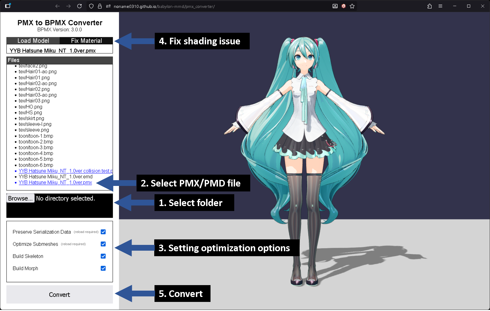
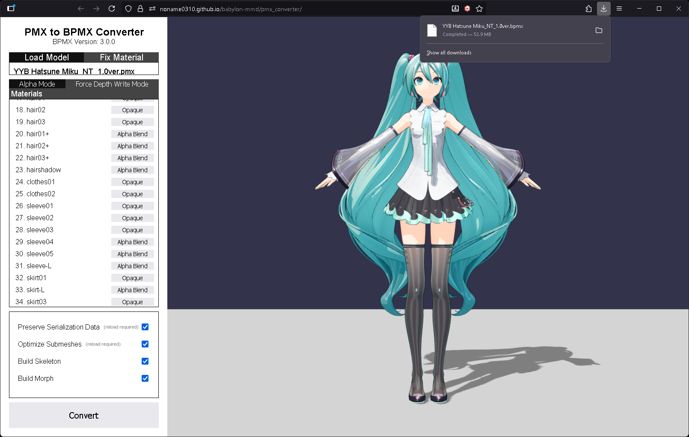
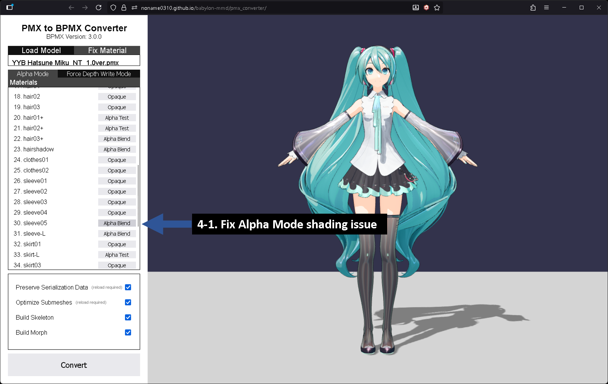
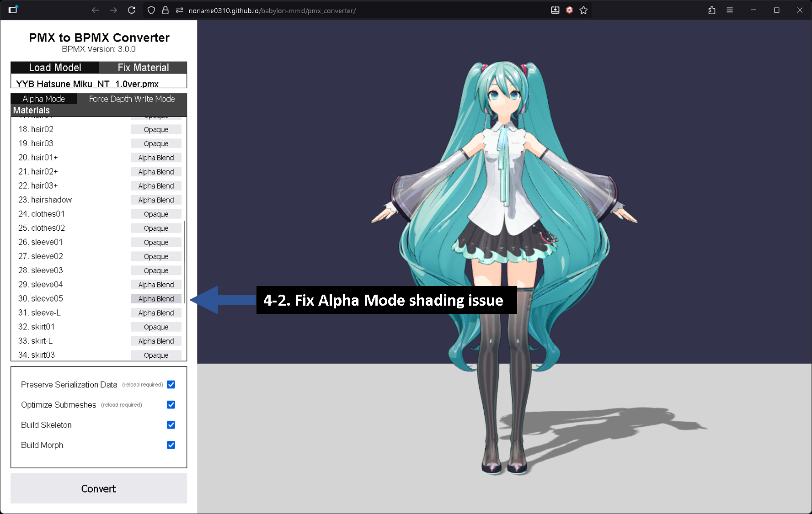

# Convert PMX to BPMX format

This section explains how to convert **PMX** files to **BPMX** files.

To convert **PMX** files to **BPMX** files, you can use one of the following two methods:

- You can use a web application for conversion.
- You can convert them programmatically.

Each method has its pros and cons, so please choose the appropriate method according to your needs.

## Use Converter Application

**babylon-mmd** provides a web application to convert **PMX/PMD** files to **BPMX** files.

You can use the application at the link below.

[PMX to BPMX Converter](https://noname0310.github.io/babylon-mmd/pmx_converter/)


*Screenshot of the **PMX to BPMX Converter**. Model: [YYB Hatsune Miku_NT](https://bowlroll.net/file/284019)*

1. **Drag and drop the folder containing the PMX/PMD file.**
    - It must include all texture files required to load the MMD model.

2. **Select the PMX/PMD file to convert from the file list, and the model will be displayed in the Scene on the right.**

3. **Set the optimization options. Each option can be set differently depending on the characteristics of the model you want to convert.**
    - ***Preserve Serialization Data***: Preserves serialization data from the **PMX/PMD** file that **babylon-mmd** does not use.
      - This includes things like **Texture path**, **Material english name**, and **Display frame**.
      - This is internally controlled by the `loaderOptions.mmdmodel.preserveSerializationData` option.
    - ***Optimize Submeshes***: Sets whether to separate **SubMeshes** into individual **Meshes**.
      - This is internally controlled by the `loaderOptions.mmdmodel.optimizeSubmeshes` option.
    - ***Build Skeleton***: Sets whether to save the model's **Skeleton** data.
      - You can turn this option off for models that do not require a skeleton, such as stages.
    - ***Build Morph Targets***: Sets whether to save the model's **Morph Target** data.
      - You can turn this option off for models that do not require Morph Targets, such as stages.

4. **Fix material rendering issues.**
   - This step is optional. If the model renders correctly, you can skip this step.
   - For this, please refer to the **Fix Material Rendering Method** section below.

5. **Perform the conversion.**

:::info
Despite its name, the **PMX to BPMX Converter** also supports **PMD** files.
:::


*The converted file downloaded in **BPMX** format.*

### Fix Material Rendering Method

**BPMX** files store the material's **Alpha Evaluation** results in the format.

Specifically, it stores the **Alpha Evaluation** results required for the **`MmdMaterialRenderMethod.AlphaEvaluation`** or **`MmdMaterialRenderMethod.DepthWriteAlphaBlendingWithEvaluation`** methods, respectively.

This result is used later when loading the model, which speeds up the model loading process by skipping the **Alpha Evaluation** step. It also allows you to manually correct and convert elements that are rendered incorrectly due to algorithm flaws.

The **Fix Material** tab provides a UI to modify these **Alpha Evaluation** results.


***Fix Material**'s Alpha Mode tab*

**Alpha Mode** shows how the model looks with the **`MmdMaterialRenderMethod.AlphaEvaluation`** render method. Here you can modify the rendering method of materials that look strange.

For the YYB Hatsune Miku_NT model, changing the rendering method of B, B-L, and sleeve05 to **Alpha Blend** gives better results.


***Fix Material**'s Force Depth Write Mode tab*

**Force Depth Write Mode** shows how the model looks with the **`MmdMaterialRenderMethod.DepthWriteAlphaBlendingWithEvaluation`** render method. Here you can modify the rendering method of materials that look strange.

For the YYB Hatsune Miku_NT model, changing the rendering method of sleeve05 to **Alpha Blend** gives better results.

## Programmatic Conversion

**BPMX** conversion is performed by the **`BpmxConverter`**.

**`BpmxConverter`** takes an **`MmdMesh`** as input and converts it to **BPMX** format.

The simplest usage example is as follows:

```typescript
const materialBuilder = new MmdStandardMaterialBuilder();
materialBuilder.deleteTextureBufferAfterLoad = false; // 1
const assetContainer = await LoadAssetContainerAsync(
    fileOrUrl,
    scene,
    {
        pluginOptions: {
            mmdmodel: {
                materialBuilder: materialBuilder,
                loggingEnabled: true
            }
        }
    }
);
const mmdMesh = assetContainer.meshes[0] as MmdMesh;

const bpmxConverter = new BpmxConverter();
bpmxConverter.loggingEnabled = true;
const arrayBuffer = bpmxConverter.convert(mmdMesh); // 2
assetContainer.dispose(); // 3
```

1. By default, the material builder is set to delete the buffer after uploading the texture to the GPU. However, this makes it impossible to serialize the texture, so you must first set the material builder's **`deleteTextureBufferAfterLoad`** option to `false`.

2. Perform the conversion using **`BpmxConverter.convert`**. This function can take options as a second parameter.

3. Release resources by calling **`assetContainer.dispose()`**. If you used **`assetContainer.addAllToScene()`**, you must manually release all resources (Geometry, Material, Texture, MorphTargetManager, Skeleton).

However, in the example above, the **Alpha Evaluation** results are not saved in the **BPMX** file. To save the **Alpha Evaluation** results, you must use **`TextureAlphaChecker`** to manually generate the **Alpha Evaluation** results and pass them to the **`BpmxConverter`**.

Here is an example that does all of this:

```typescript
const settings = {
    preserveSerializationData: true,
    optimizeSubmeshes: true,
    buildSkeleton: true,
    buildMorph: true
};

const materialBuilder = new MmdStandardMaterialBuilder();
materialBuilder.deleteTextureBufferAfterLoad = false;
materialBuilder.renderMethod = MmdMaterialRenderMethod.AlphaEvaluation;
materialBuilder.forceDisableAlphaEvaluation = true;

const textureAlphaChecker = new TextureAlphaChecker(scene);

const assetContainer = await LoadAssetContainerAsync(
    fileOrUrl,
    scene,
    {
        pluginOptions: {
            mmdmodel: {
                materialBuilder: materialBuilder,
                preserveSerializationData: settings.preserveSerializationData,
                optimizeSubmeshes: settings.optimizeSubmeshes,
                loggingEnabled: true
            }
        }
    }
);
const mmdMesh = assetContainer.meshes[0] as MmdMesh;

const meshes = mmdMesh.metadata.meshes;
const materials = mmdMesh.metadata.materials;
const translucentMaterials: boolean[] = new Array(materials.length).fill(false);
const alphaEvaluateResults: number[] = new Array(materials.length).fill(-1);

for (let i = 0; i < materials.length; ++i) {
    const material = materials[i] as MmdStandardMaterial;

    // collect referenced meshes
    const referencedMeshes: ReferencedMesh[] = [];
    for (let meshIndex = 0; meshIndex < meshes.length; ++meshIndex) {
        const mesh = meshes[meshIndex];
        if ((mesh.material as MultiMaterial).subMaterials !== undefined) {
            const subMaterials = (mesh.material as MultiMaterial).subMaterials;
            for (let subMaterialIndex = 0; subMaterialIndex < subMaterials.length; ++subMaterialIndex) {
                const subMaterial = subMaterials[subMaterialIndex];
                if (subMaterial === material) {
                    referencedMeshes.push({
                        mesh,
                        subMeshIndex: subMaterialIndex
                    });
                }
            }
        } else {
            if (mesh.material === material) referencedMeshes.push(mesh);
        }
    }

    const diffuseTexture = material.diffuseTexture;

    // evaluate DepthWriteAlphaBlendingWithEvaluation renderMethod result manually
    if (material.alpha < 1) {
        translucentMaterials[i] = true;
    } else if (!diffuseTexture) {
        translucentMaterials[i] = false;
    } else {
        translucentMaterials[i] = true;
        for (let referencedMeshIndex = 0; referencedMeshIndex < referencedMeshes.length; ++referencedMeshIndex) {
            const referencedMesh = referencedMeshes[referencedMeshIndex];
            let isOpaque = false;
            if ((referencedMesh as { mesh: Mesh; subMeshIndex: number }).subMeshIndex !== undefined) {
                const { mesh, subMeshIndex } = referencedMesh as { mesh: Mesh; subMeshIndex: number };
                isOpaque = await textureAlphaChecker.hasFragmentsOnlyOpaqueOnGeometryAsync(diffuseTexture, mesh, subMeshIndex);
            } else {
                isOpaque = await textureAlphaChecker.hasFragmentsOnlyOpaqueOnGeometryAsync(diffuseTexture, referencedMesh as Mesh, null);
            }
            if (isOpaque) {
                translucentMaterials[i] = false;
                break;
            }
        }
    }

    // evaluate AlphaEvaluation renderMethod result manually
    if (diffuseTexture !== null) {
        let transparencyMode = Number.MIN_SAFE_INTEGER;
        for (let i = 0; i < referencedMeshes.length; ++i) {
            const referencedMesh = referencedMeshes[i];

            const newTransparencyMode = await textureAlphaChecker.hasTranslucentFragmentsOnGeometryAsync(
                diffuseTexture,
                (referencedMesh as { mesh: Mesh })?.mesh ?? referencedMesh as Mesh,
                (referencedMesh as { subMeshIndex: number })?.subMeshIndex !== undefined
                    ? (referencedMesh as { subMeshIndex: number }).subMeshIndex
                    : null,
                materialBuilder.alphaThreshold,
                materialBuilder.alphaBlendThreshold
            );

            if (transparencyMode < newTransparencyMode) {
                transparencyMode = newTransparencyMode;
            }
        }
        alphaEvaluateResults[i] = transparencyMode !== Number.MIN_SAFE_INTEGER
            ? transparencyMode
            : Material.MATERIAL_OPAQUE;
    } else {
        alphaEvaluateResults[i] = Material.MATERIAL_OPAQUE;
    }
}

const bpmxConverter = new BpmxConverter();
bpmxConverter.loggingEnabled = true;
const arrayBuffer = bpmxConverter.convert(mmdMesh, {
    buildSkeleton: settings.buildSkeleton,
    buildMorph: settings.buildMorph,
    translucentMaterials: translucentMaterials,
    alphaEvaluateResults: alphaEvaluateResults
});
assetContainer.dispose();
```

You can create a function for this to reuse it as needed.

The **`BpmxConverter`** API supports various options, making it very tricky to write code that fully adheres to all specifications, but you can get useful results by selectively using only the features you need.
