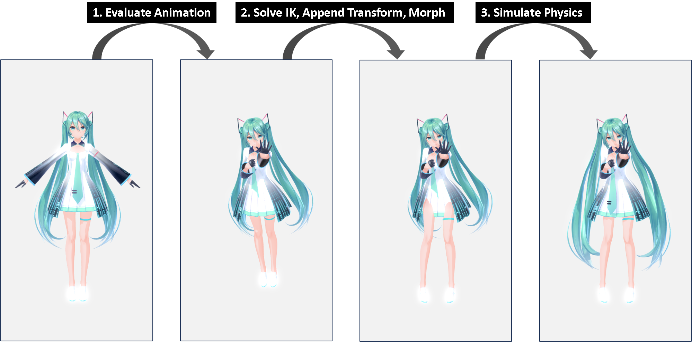

# Runtime

This section describes the MMD runtime components of babylon-mmd.

The MMD runtime provides components necessary for applying animations to MMD models and cameras, as well as features to handle various other scenarios.

## Types of Animation Application

The way you load and use the runtime varies depending on the format of the 3D models and animation data you're working with.

For example, the most common scenario is loading a PMX model and applying VMD animation. This is handled by default, and we also discuss more complex scenarios.

Before proceeding with the explanation, let's clarify some terms used in this section:

- **MMD Model**: 3D models loaded from PMD/PMX formats used in MMD software and the BPMX format of babylon-mmd
- **MMD Animation**: Animation data loaded from VMD/VPD formats used in MMD software and the BVMD format of babylon-mmd
- **Humanoid Model**: Non-MMD models in human form, typically loaded from FBX, GLTF, VRM formats
- **Humanoid Animation**: Animation data applied to Humanoid Models, typically loaded from FBX, GLTF, VRMA formats

We discuss three cases:

1. **Applying MMD Animation to MMD Model**
2. **Applying Humanoid Animation to MMD Model**
3. **Applying MMD Animation to Humanoid Model**

It's important to clearly understand the required components as different runtime components are used for each case.

## Applying MMD Animation to MMD Model

Applying MMD Animation to an MMD Model is the most basic and core functionality of babylon-mmd, and many options are provided to achieve this.

Basically, this is handled by the MMD Runtime.

### MMD Runtime Components

The runtime is modularized by functionality, allowing for selective use as needed.

The following three processes for applying MMD animations are separated into independent modules:

*Image visualizing each process. Model: YYB Hatsune Miku_10th, Motion: メランコリ・ナイト by ほうき堂, Frame 3390.*
:::info
Strictly speaking, the order of 'Solve IK, Append Transform, Morph' and 'Simulate Physics' can be changed. However, in general scenarios, they are mostly processed in the order shown in the figure.
:::

1. **Evaluate Animation**
2. **Solve IK, Append Transform, Morph**
3. **Simulate Physics**

Various methods are provided for handling each process, and users can select the appropriate method according to their needs.

### Evaluate Animation

Evaluate Animation is the process of evaluating animation data from `MmdAnimation` for a specific time `frameTime`.

The following implementations are provided to perform this:

**Standalone:**
|Class|Description|Notes|
|---|---|---|
|`MmdRuntimeCameraAnimation`|Camera animation evaluator implementation|Standard JavaScript implementation providing stable and decent performance.|
|`MmdRuntimeModelAnimation`|Model animation evaluator implementation|Standard JavaScript implementation providing stable and decent performance.|

**Babylon.js `Animation` based:**
|Class|Description|Notes|
|---|---|---|
|`MmdRuntimeCameraAnimationContainer`|Babylon.js `Animation` based camera animation evaluator implementation|Uses Babylon.js animation container `Animation`.|
|`MmdRuntimeModelAnimationContainer`|Babylon.js `Animation` based model animation evaluator implementation|Uses Babylon.js animation container `Animation`.|

**Babylon.js animation runtime based:**
|Class|Description|Notes|
|---|---|---|
|`AnimationGroup`|Babylon.js animation runtime|Delegates all processes to Babylon.js animation runtime|

**WebAssembly based standalone:**
|Class|Description|Notes|
|---|---|---|
|`MmdWasmRuntimeModelAnimation`|WebAssembly based MMD animation evaluator implementation|Provides excellent performance. WebAssembly based implementation is not provided for camera animation.|

**Special purpose standalone:**
|Class|Description|Notes|
|---|---|---|
|`MmdCompositeRuntimeCameraAnimation`|Camera animation evaluator implementation supporting animation blending| |
|`MmdCompositeRuntimeModelAnimation`|Model animation evaluator implementation supporting animation blending| |

### Solve IK, Append Transform, Morph

MMD models must be controlled according to MMD specifications. For this, a solver for IK, Append Transform, and Morph is required.

The following implementations are provided to perform this:

|Class|Description|Notes|
|---|---|---|
|`MmdRuntime`|Default implementation|Provides stable and decent performance. Easy to customize through inheritance, etc.|
|`MmdWasmRuntime`|WebAssembly based implementation|Provides excellent performance. Difficult to customize.|

### Simulate Physics

MMD models can perform physics simulations by applying Rigidbody to hair and clothes.

The following implementations are provided for this:

|Class|Description|Notes|
|---|---|---|
|`MmdBulletPhysics`|Bullet Physics based implementation|WebAssembly ported version of Bullet Physics provided by babylon-mmd.|
|`MmdWasmPhysics`|Bullet Physics based implementation exclusively for `MmdWasmRuntime`|Implementation with lowest FFI cost providing highest performance. Difficult to customize.|
|`MmdAmmoPhysics`|Ammo.js Physics Plugin based implementation|Slightly unstable. Low performance. Can operate with asm.js version in environments that cannot run WebAssembly.|
|`MmdPhysics`|Havok Physics Plugin based implementation|Low simulation reproduction. Unstable. Recommended only in special situations requiring Havok Physics.|

### Common Runtime Combination Examples

We can choose the optimal runtime combination for each process.

**The most stable combination that is easy to customize** is as follows:

|Process|Class|
|---|---|
|Evaluate Animation|`MmdRuntimeCameraAnimation`, `MmdRuntimeModelAnimation`|
|Solve IK, Append Transform, Morph|`MmdRuntime`|
|Simulate Physics|`MmdBulletPhysics`|

**The highest performance combination** is as follows:

|Process|Class|
|---|---|
|Evaluate Animation|`MmdRuntimeCameraAnimation`, `MmdWasmRuntimeModelAnimation`|
|Solve IK, Append Transform, Morph|`MmdWasmRuntime`|
|Simulate Physics|`MmdWasmPhysics`|

**In environments that cannot run WebAssembly**, the following combination can be used:

|Process|Class|
|---|---|
|Evaluate Animation|`MmdRuntimeCameraAnimation`, `MmdRuntimeModelAnimation`|
|Solve IK, Append Transform, Morph|`MmdRuntime`|
|Simulate Physics|`MmdAmmoPhysics`|

## Applying Humanoid Animation to MMD Model

The process of applying humanoid animation to an MMD model is not much different from applying MMD animation to an MMD model.

As mentioned above, MMD animation consists of the following three processes:

1. **Evaluate Animation**
2. **Solve IK, Append Transform, Morph**
3. **Simulate Physics**

You can apply Humanoid Animation instead of MMD Animation by changing only the first process.

The `AnimationRetargeter` class is provided for this purpose. It retargets humanoid animation to fit the MMD model.

After loading any humanoid animation as an `AnimationGroup` using the Babylon.js SceneLoader,
you can apply humanoid animation to an MMD model by using `AnimationRetargeter` to retarget the Humanoid Animation to fit the MMD model.

In this case, `AnimationGroup` is used in the Evaluate Animation process.

## Applying MMD Animation to Humanoid Model

You can apply MMD animation to a humanoid model using the utility class `HumanoidMmd`.

Due to structural differences between Humanoid Models and MMD Models, it is impossible to directly apply MMD Animation to a Humanoid Model.

Therefore, `HumanoidMmd` uses a proxy skeleton to apply MMD Animation and retarget the results to the Humanoid Model in real-time.

The process of applying MMD Animation to a Humanoid Model is almost the same as applying MMD animation to an MMD model, but with the additional step of wrapping the Humanoid Model as an Mmd Model.

## Other Elements

The topics discussed above only cover how to apply animation to MMD models, but in reality, various elements participate in the runtime alongside MMD models.

These elements include:

- **Audio or video sources**
- **Cameras**
- **UI elements**

These are very common elements, but they are implemented very elaborately, so separate reference documentation is also provided for proper use.
