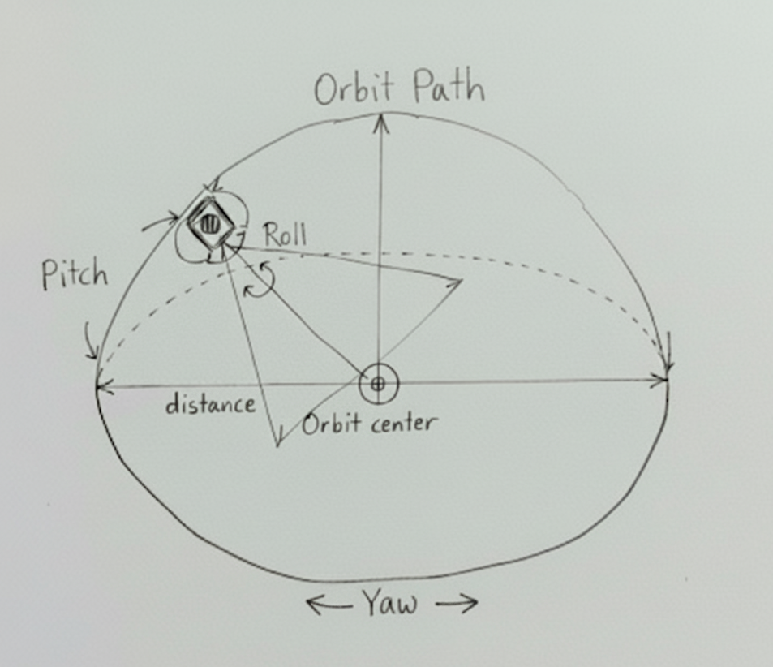

# MMD Camera

This section describes the **`MmdCamera`** class and the **`IMmdCamera`** interface, which reproduce the camera behavior of MMD.

## MmdCamera class


*Visual representation of the MMD camera orbit path*

The camera in MMD is an **Orbit Camera** that rotates around a center position.
The **`MmdCamera`** class reproduces this, and therefore the parameters for controlling the camera are as follows:

- **position** (Vector3) - Orbit center position
- **rotation** (Vector3) - Yaw Pitch Roll
- **distance** (number) - Distance from the Orbit center
- **fov** (number) - Field of view in radians

The **`MmdCamera`** class inherits from Babylon.js **`Camera`** class. Therefore, like other Babylon.js cameras, it can be added to the Scene for use.

## Creating a Camera

You can create an **`MmdCamera`** and add it to the Scene with the following code:

```typescript
const mmdCamera = new MmdCamera("mmdCamera", new Vector3(0, 10, 0), scene, true);
```

Each parameter means the following in order:
- **name**: Camera name
- **position**: Initial Orbit center value (default: (0, 10, 0))
- **scene**: Scene to add the camera to (default: Engine.LastCreatedScene)
- **setActiveOnSceneIfNoneActive**: Whether to set this camera as the active camera in the Scene if no other camera is defined after creation (default: true)

## Animation Binding

The **`MmdCamera`** can bind and use **`MmdAnimation`** created from VMD or BVMD files.

```typescript
const vmdLoader = new VmdLoader();
const mmdAnimation = await vmdLoader.loadAsync("path/to/file.vmd");

const mmdCamera = new MmdCamera("camera", new Vector3(0, 10, 0), scene);
const animationHandle: MmdRuntimeAnimationHandle = mmdCamera.createRuntimeAnimation(mmdAnimation);
```

The code above is an example of loading a VMD file to create an **`MmdAnimation`** and binding it to an **`MmdCamera`**.

You can create a bound "Runtime Animation" using the **`MmdCamera.createRuntimeAnimation`** method. The result returned by the function is not the actual runtime animation object but a handle to the object.

### runtimeAnimations

The created runtime animation object is added to **`MmdCamera.runtimeAnimations`**.

This allows for more low-level control by accessing the actual runtime animation object rather than the proxy.

## Using Animation

To use the bound runtime animation, call the **`MmdCamera.setRuntimeAnimation`** method:

```typescript
mmdCamera.setRuntimeAnimation(animationHandle);
```

By default, the **`MmdCamera`** object can only play one animation at a time.

To remove the currently set animation, pass **`null`** as an argument:

```typescript
mmdCamera.setRuntimeAnimation(null);
```

The currently set animation can be accessed through the **`MmdCamera.currentAnimation`** property.

## Destroying Runtime Animation

To destroy a runtime animation bound to the **`MmdCamera`**, call the **`destroyRuntimeAnimation`** method:

```typescript
mmdCamera.destroyRuntimeAnimation(animationHandle);
```

If you don't destroy camera runtime animations that are no longer used, memory leaks won't occur, but runtime errors might occur in some special cases.

## Evaluating Animation

You can evaluate the currently set animation using the **`MmdCamera.animate()`** method.

This method is **typically not called directly** but is called by the MMD runtime.

If you are manually controlling the MmdCamera, you can call this method to evaluate the animation:

```typescript
let sec = 0;
scene.onBeforeRenderObservable.add(() => {
    const frameTime = sec * 30; // MMD operates at 30fps
    mmdCamera.animate(frameTime); // Evaluate animation. Pass time scaled in 30 frame units as a parameter
    sec += engine.getDeltaTime() / 1000;
});
```

## IMmdCamera interface

babylon-mmd provides the **`IMmdCamera`** interface to allow users to implement their own MMD camera.

All components of babylon-mmd use the **`IMmdCamera`** interface instead of the **`MmdCamera`** class type to reference or pass MMD camera objects.
