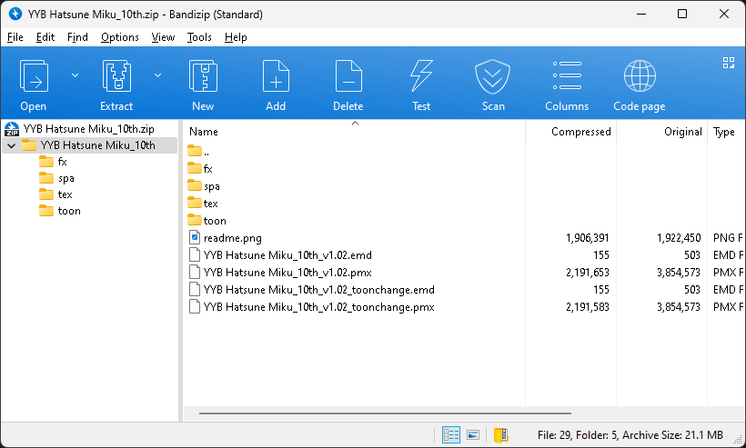
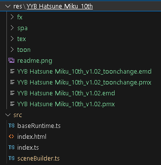
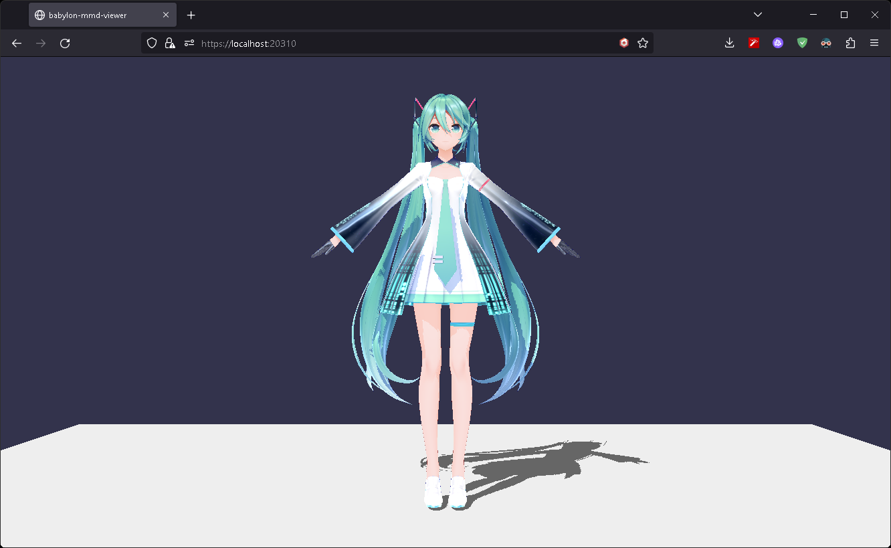

# Load MMD Model

Learn how to load models in PMX format.

## Download MMD Model: "YYB Hatsune Miku_10th"

If you have a pmx model you want, you can use it.

In this tutorial, we will use the "YYB Hatsune Miku_10th" model.

You can download it from **[here](https://www.deviantart.com/sanmuyyb/art/YYB-Hatsune-Miku-10th-DL-702119716)**.



Unzip the downloaded zip file and copy the "YYB Hatsune Miku_10th" folder to the "res" folder.



Your file structure should look like this.

## Load PMX Model

For load pmx model, we need to import side effects.

```typescript title="src/sceneBuilder.ts"
import "babylon-mmd/esm/Loader/pmxLoader";
```

Then, load the model using the `loadAssetContainerAsync`.

```typescript title="src/sceneBuilder.ts"
const mmdMesh = await loadAssetContainerAsync("res/YYB Hatsune Miku_10th/YYB Hatsune Miku_10th_v1.02.pmx", scene)
    .then((result) => {
        result.addAllToScene();
        return result.meshes[0] as MmdMesh;
    });
for (const mesh of mmdMesh.metadata.meshes) mesh.receiveShadows = true;
shadowGenerator.addShadowCaster(mmdMesh);
```

- `loadAssetContainerAsync` - Load the model (All other loading methods like `SceneLoader.ImportMeshAsync` are also supported).
    - `"res/YYB Hatsune Miku_10th/YYB Hatsune Miku_10th_v1.02.pmx"` - the path to the model file. If you pass a File object, you can load the model from the File object.
    - `scene` - the scene to load the model into.

- An loadAssetContainerAsync call in pmx file guarantees that result.meshes length is always greater than 0 and result.meshes[0] is always a root mesh which type is MmdMesh.

- Below is the shadow setting. see [Shadows | Babylon.js Documentation](https://doc.babylonjs.com/features/featuresDeepDive/lights/shadows) for more information.


