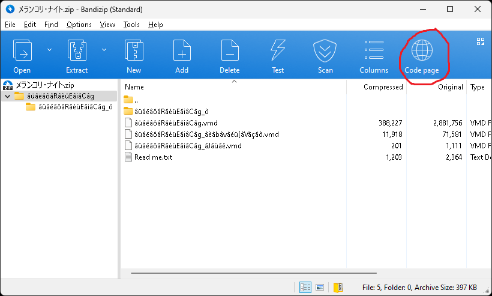
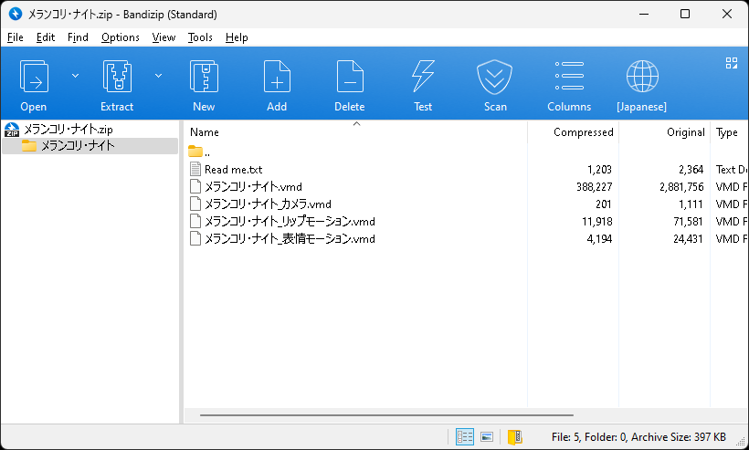
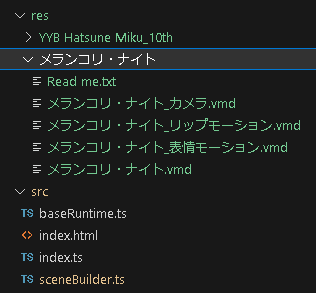

# Load Animation

Learn how to load and play animations in VMD format.

## Download Animation: "メランコリ・ナイト"

If you already have a desired motion, feel free to use it. In this tutorial, we will use "メランコリ・ナイト" by ほうき堂

You can download the motion from **[here](https://www.nicovideo.jp/watch/sm41164308)**.

*Check the video description for the download link.*



Compressed files distributed by the Japanese often have encoding problems. Compression programs such as [Bandizip](https://en.bandisoft.com/bandizip/) can solve this problem by changing the codepage.



Unzip the downloaded zip file and copy the "メランコリ・ナイト" folder to the "res" folder.



Your file structure should look like this.

## Create MMD Runtime

MMD has its proprietary animation system, so babylon-mmd provides a runtime to reproduce it. We will create an MMD Runtime and make the camera and mesh controlled by the runtime.

```typescript title="src/sceneBuilder.ts"
const mmdRuntime = new MmdRuntime(scene);
mmdRuntime.register(scene);

mmdRuntime.setCamera(camera);
const mmdModel = mmdRuntime.createMmdModel(mmdMesh);
```

- `mmdRuntime.register(scene)` - Register the runtime to the scene update loop. This is required to runtime to work.
- `mmdRuntime.setCamera(camera)` - Set the camera to be controlled by the runtime.
- `mmdRuntime.createMmdModel(mmdMesh)` - Create an MMD model from the mesh. `MmdModel` is a kind of controller that abstracts and controls Mesh from the perspective of MMD.

## Load VMD Animation

For load VMD animation, we use the `VmdLoader`.

```typescript title="src/sceneBuilder.ts"
const vmdLoader = new VmdLoader(scene);
const modelMotion = await vmdLoader.loadAsync("model_motion_1", [
    "res/メランコリ・ナイト/メランコリ・ナイト.vmd",
    "res/メランコリ・ナイト/メランコリ・ナイト_表情モーション.vmd",
    "res/メランコリ・ナイト/メランコリ・ナイト_リップモーション.vmd"
]);
const cameraMotion = await vmdLoader.loadAsync("camera_motion_1",
    "res/メランコリ・ナイト/メランコリ・ナイト_カメラ.vmd"
);
```

- `vmdLoader.loadAsync` returns `MmdAnimation`, which can store one model and one camera animation. There is no type distinction between camera animation and model animation.

- The motion we are currently using is divided into skeleton, facial, and lip components. While combining them in advance and loading as one would be more performance-efficient, in this tutorial, we will use a feature to merge multiple motions into one.
    - By looking at the code for creating `modelMotion` you can identify the merging method.

For handle `MmdAnimation` we need to import animtion runtime side-effect.

```typescript title="src/sceneBuilder.ts"
import "babylon-mmd/esm/Runtime/Animation/mmdRuntimeCameraAnimation";
import "babylon-mmd/esm/Runtime/Animation/mmdRuntimeModelAnimation";
```

Here's how to add and play animations.

```typescript title="src/sceneBuilder.ts"
mmdModel.addAnimation(modelMotion);
mmdModel.setAnimation("model_motion_1");

camera.addAnimation(cameraMotion);
camera.setAnimation("camera_motion_1");

mmdRuntime.playAnimation();
```

- Both `MmdCamera` and `MmdModel` are designed to store multiple animations. Therefore, you must set the animation to use after adding it.
- `mmdRuntime.playAnimation()` - Start playing the animation.

import ResultVideo from "./2023-07-27 17-00-43.mp4";

<video controls style={{ width: "100%", height: "100%" }}>
  <source src={ResultVideo} type="video/mp4"/>
</video>
