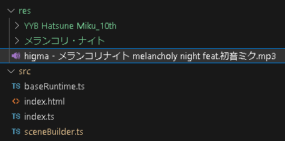

# Audio and Player Controls

Add synchronized audio and use simple player controls.

## Download Music: "メランコリ・ナイト"

Download the sample music for the tutorial.

[higma - メランコリ・ナイト / melancholy night feat.初音ミク](https://www.youtube.com/watch?v=y__uZETTuL8) - YouTube

[YouTube to Mp3 Converter](https://ytmp3.nu/9a9B37/) - YtMp3

Put the downloaded mp3 file in the "res" folder.



## Create Stream Audio Player

Stream Audio Player is our built-in player, is a fast-load player thanks to streaming audio processing.

```typescript title="src/sceneBuilder.ts"
const audioPlayer = new StreamAudioPlayer(scene);
audioPlayer.source = "res/higma - メランコリナイト melancholy night feat.初音ミク.mp3";
mmdRuntime.setAudioPlayer(audioPlayer);
```

:::info
By default, the browser does not have permission to play audio until the user interaction.

If `audioPlayer.unmute()` is invoked by user interaction, it is resolved and is also provided in the player control introduced below.
:::

## Create Player Controls

Create a simple player control.

```typescript title="src/sceneBuilder.ts"
new MmdPlayerControl(scene, mmdRuntime, audioPlayer);
```

- There are not many customization available for player controls. This feature is for testing purposes only, and if you want more, you need to implement it yourself.

import ResultVideo from "./2023-07-27 17-39-27.mp4";

<video controls style={{ width: "100%", height: "100%" }}>
  <source src={ResultVideo} type="video/mp4"/>
</video>
