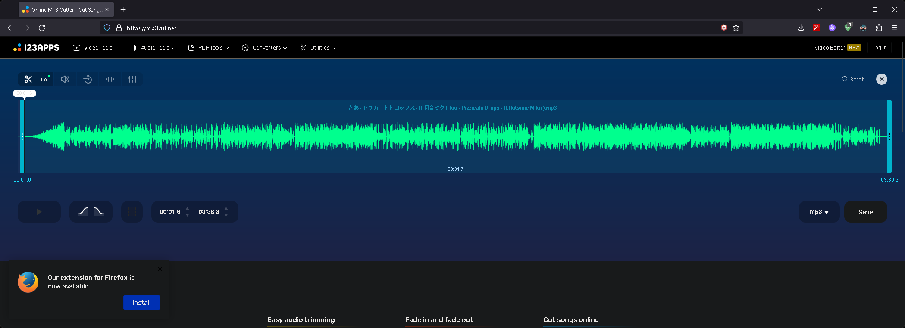
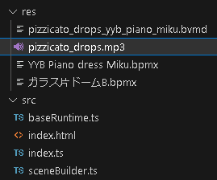

# Audio And Player Controls

Add synchronized audio and use simple player controls.

## Download Music: "ピチカートドロップス"

Download the sample music for the tutorial.

[とあ - ピチカートドロップス - ft.初音ミク ( Toa - Pizzicato Drops - ft.Hatsune Miku )](https://www.youtube.com/watch?v=eYKAwm-sZ-o) - YouTube

[YouTube to Mp3 Converter](https://ytmp3.nu/9a9B37/) - YtMp3

Motion and music start times won't match. So we need to adjust the start time of the music.

For this, we use [Online MP3 Cutter - Cut Songs, Make Ringtones](https://mp3cut.net/).

Set the start time to 00:01.6.



Put the downloaded mp3 file in the "res" folder as "pizzicato_drops.mp3".



## Create Stream Audio Player

Stream Audio Player is our built-in player, is a fast-load player thanks to streaming audio processing.

```typescript title="src/sceneBuilder.ts"
const audioPlayer = new StreamAudioPlayer(scene);
audioPlayer.preservesPitch = false;
audioPlayer.source = "res/pizzicato_drops.mp3";
mmdRuntime.setAudioPlayer(audioPlayer);
```

- `new StreamAudioPlayer(disposeObservable)` Create a new Stream Audio Player.
    - The audio player must be disposed when no longer needed. and if you want to dispose of the audio player when the scene is disposed, pass the scene. You can also put objects other than the scene.
- `audioPlayer.preservesPitch = false;` If you want to play the audio at the original pitch when the animation is played at a different speed, set it to `true`.

:::info
By default, the browser does not have permission to play audio until the user interaction.

If `audioPlayer.unmute()` is invoked by user interaction, it is resolved and is also provided in the player control introduced below.
:::

## Create Player Controls

Create a simple player control.

```typescript title="src/sceneBuilder.ts"
new MmdPlayerControl(scene, mmdRuntime, audioPlayer);
```

- `audioPlayer` parameter is optional. If you don't use audio, you can omit it.

- There are not many customization available for player controls. This feature is for testing purposes only, and if you want more, you need to implement it yourself.

import ReactPlayer from "react-player";
import ResultVideo from "./2023-07-29 19-23-19.mp4";

<ReactPlayer
    url={ResultVideo}
    controls={true}
    width="100%"
    height="100%"/>
