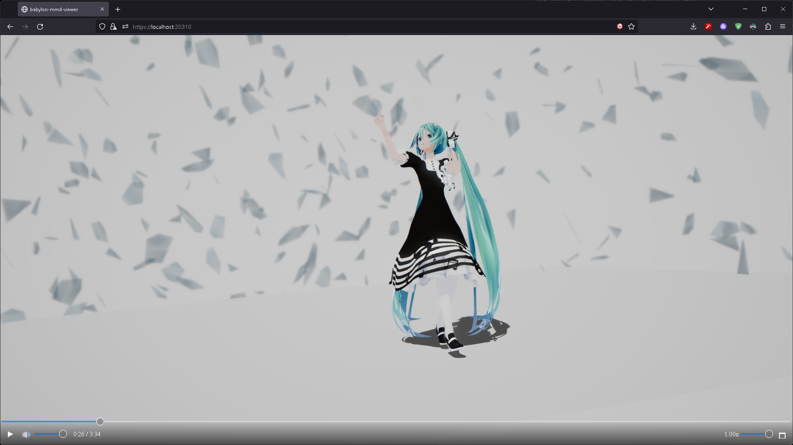
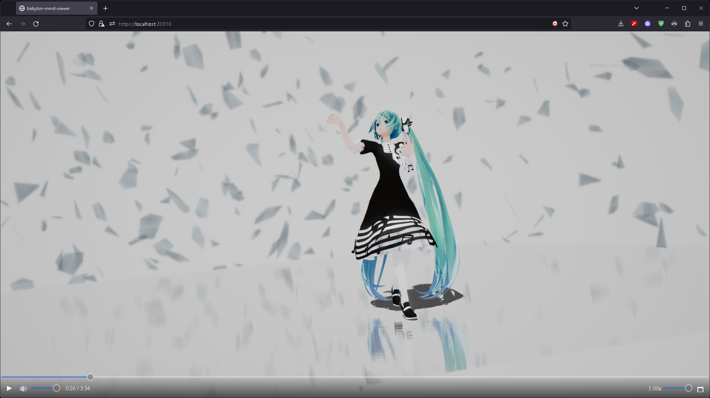

# Post Processes

Apply post processing to improve the quality of the output.

Since it is not a feature of babylon-mmd, I will not explain the setting in detail.

## Use Default Rendering Pipeline

```typescript title="src/sceneBuilder.ts"
import "@babylonjs/core/Rendering/prePassRendererSceneComponent";
import "@babylonjs/core/Rendering/depthRendererSceneComponent";

const defaultPipeline = new DefaultRenderingPipeline("default", true, scene, [mmdCamera]);
defaultPipeline.samples = 4;
defaultPipeline.bloomEnabled = true;
defaultPipeline.chromaticAberrationEnabled = true;
defaultPipeline.chromaticAberration.aberrationAmount = 1;
defaultPipeline.depthOfFieldEnabled = true;
defaultPipeline.depthOfFieldBlurLevel = DepthOfFieldEffectBlurLevel.High;
defaultPipeline.fxaaEnabled = true;
defaultPipeline.imageProcessingEnabled = true;
defaultPipeline.imageProcessing.toneMappingEnabled = true;
defaultPipeline.imageProcessing.toneMappingType = ImageProcessingConfiguration.TONEMAPPING_ACES;
defaultPipeline.imageProcessing.vignetteWeight = 0.5;
defaultPipeline.imageProcessing.vignetteStretch = 0.5;
defaultPipeline.imageProcessing.vignetteColor = new Color4(0, 0, 0, 0);
defaultPipeline.imageProcessing.vignetteEnabled = true;

defaultPipeline.depthOfField.fStop = 0.05;
defaultPipeline.depthOfField.focalLength = 20;

for (const depthRenderer of Object.values(scene._depthRenderer)) {
    depthRenderer.forceDepthWriteTransparentMeshes = true;
}

const headBone = modelMesh.skeleton!.bones.find((bone) => bone.name === "頭");

const rotationMatrix = new Matrix();
const cameraNormal = new Vector3();
const cameraEyePosition = new Vector3();
const headRelativePosition = new Vector3();

scene.onBeforeRenderObservable.add(() => {
    const cameraRotation = mmdCamera.rotation;
    Matrix.RotationYawPitchRollToRef(-cameraRotation.y, -cameraRotation.x, -cameraRotation.z, rotationMatrix);

    Vector3.TransformNormalFromFloatsToRef(0, 0, 1, rotationMatrix, cameraNormal);

    mmdCamera.position.addToRef(
        Vector3.TransformCoordinatesFromFloatsToRef(0, 0, mmdCamera.distance, rotationMatrix, cameraEyePosition),
        cameraEyePosition
    );

    headBone!.getFinalMatrix().getTranslationToRef(headRelativePosition)
        .subtractToRef(cameraEyePosition, headRelativePosition);

    defaultPipeline.depthOfField.focusDistance = (Vector3.Dot(headRelativePosition, cameraNormal) / Vector3.Dot(cameraNormal, cameraNormal)) * 1000;
});
```

- [DefaultRenderingPipeline | Babylon.js Documentation](https://doc.babylonjs.com/features/featuresDeepDive/postProcesses/defaultRenderingPipeline)

:::tip
above code includes automatic focus adjustment which is not documented in the Babylon.js documentation.

This operation is only valid for `MmdCamera` type. However, it can be a hint to implement auto-focus on other cameras.
:::

Result:



## Use SSR Rendering Pipeline

```typescript title="src/sceneBuilder.ts"
import "@babylonjs/core/Rendering/geometryBufferRendererSceneComponent";

const ssrRenderingPipeline = new SSRRenderingPipeline(
    "ssr",
    scene,
    [mmdCamera],
    false,
    Constants.TEXTURETYPE_UNSIGNED_BYTE
);
ssrRenderingPipeline.step = 32;
ssrRenderingPipeline.maxSteps = 128;
ssrRenderingPipeline.maxDistance = 500;
ssrRenderingPipeline.enableSmoothReflections = false;
ssrRenderingPipeline.enableAutomaticThicknessComputation = false;
ssrRenderingPipeline.blurDownsample = 2;
ssrRenderingPipeline.ssrDownsample = 2;
ssrRenderingPipeline.thickness = 0.1;
ssrRenderingPipeline.selfCollisionNumSkip = 2;
ssrRenderingPipeline.blurDispersionStrength = 0;
ssrRenderingPipeline.roughnessFactor = 0.1;
ssrRenderingPipeline.reflectivityThreshold = 0.9;
ssrRenderingPipeline.samples = 4;
```

- [SSRRenderingPipeline | Babylon.js Documentation](https://doc.babylonjs.com/features/featuresDeepDive/postProcesses/SSRRenderingPipeline)

Result:


